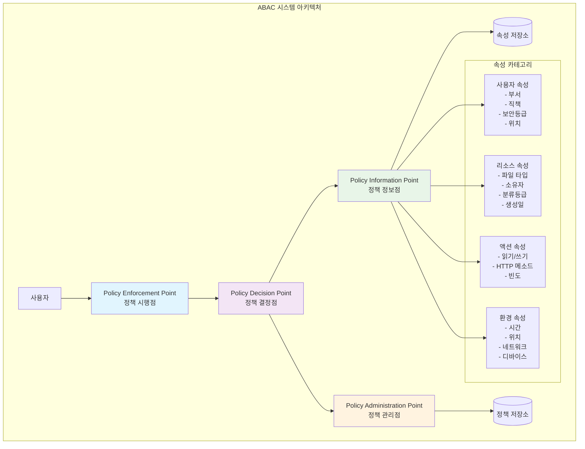
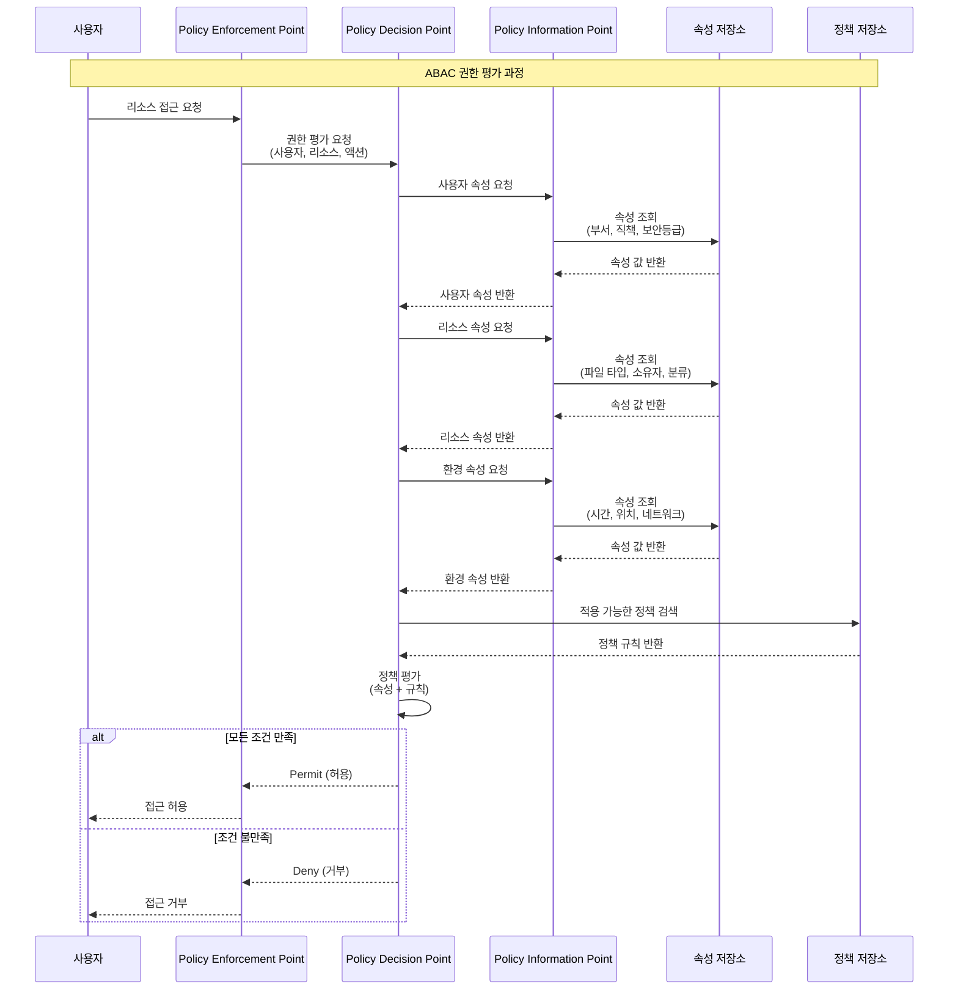
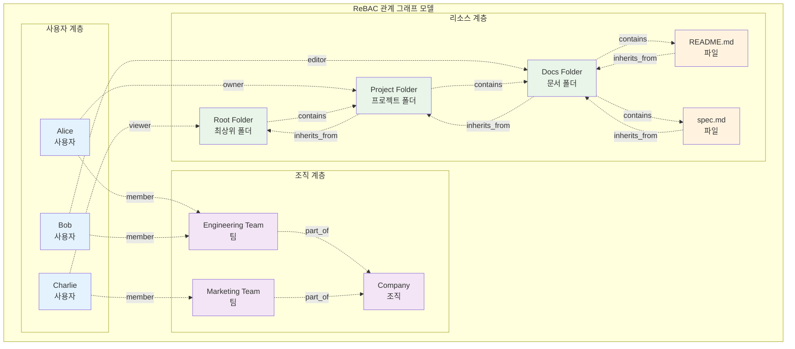
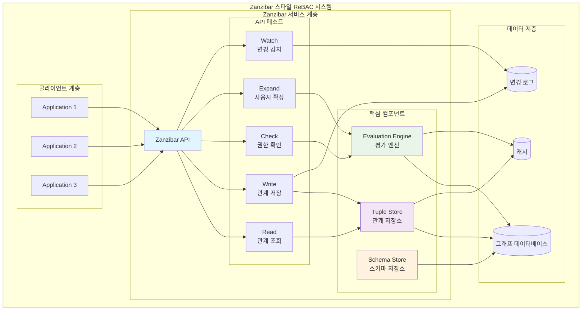
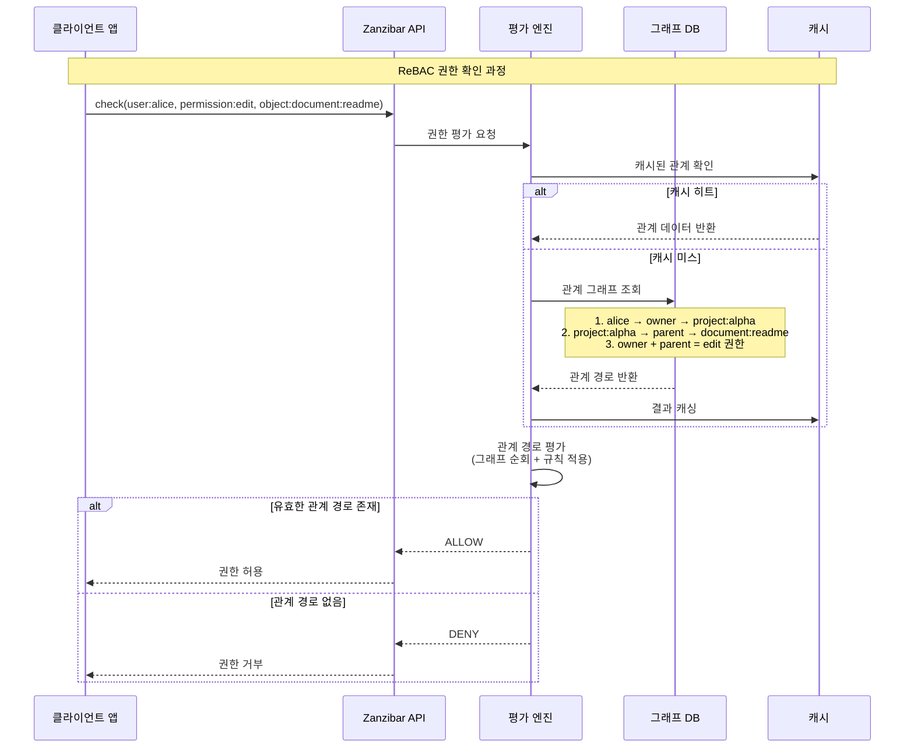
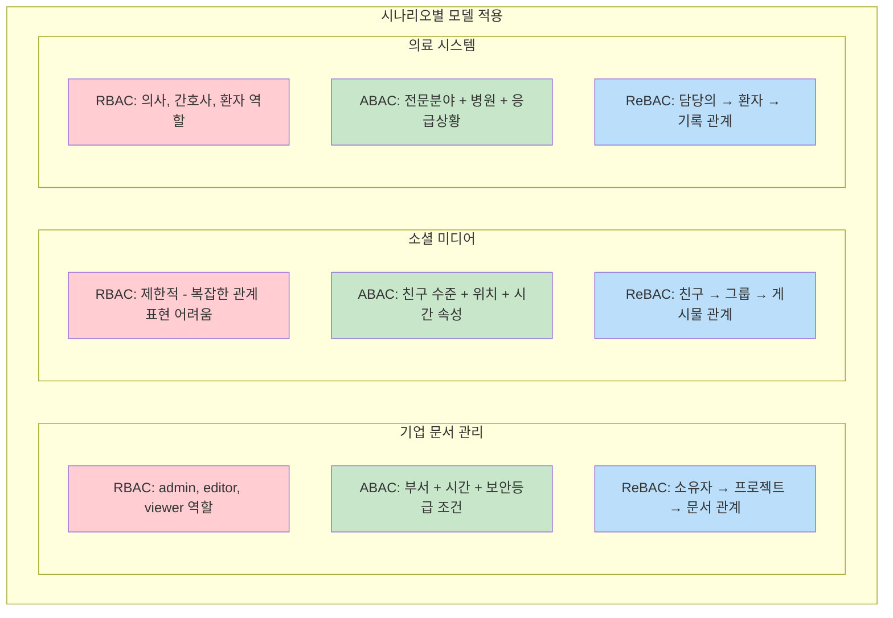
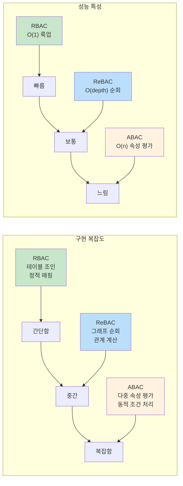
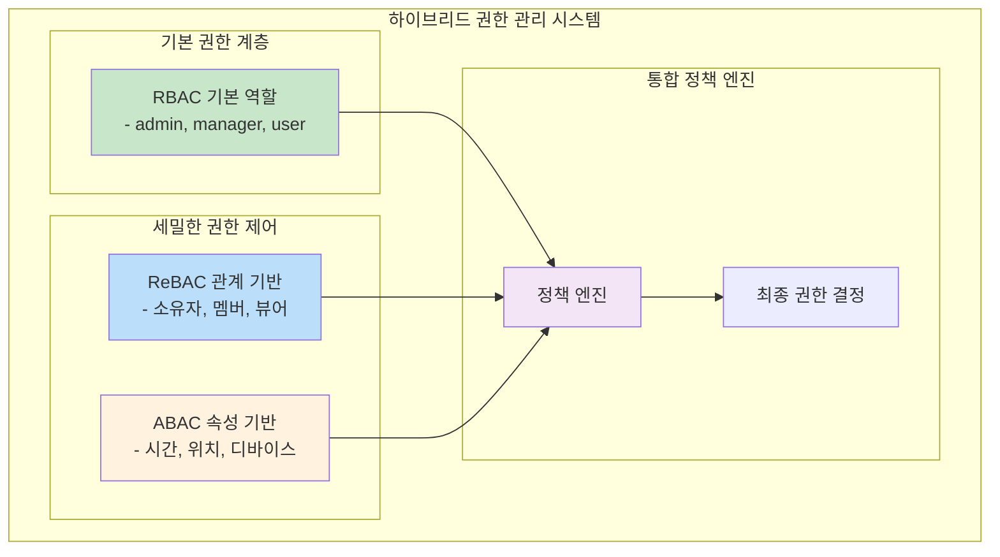

# ABAC와 ReBAC 모델링 및 다이어그램 설명

이전에 말씀드린 대로 **리소스 테이블에 직접 권한을 매핑하는 방식**은 RBAC의 세분화된 구현이지, ABAC나 ReBAC와는 다른 접근 방식입니다. 이제 ABAC와 ReBAC가 어떻게 다르게 모델링되고 구현되는지 상세히 설명해드리겠습니다.

## 1. ABAC (Attribute-Based Access Control) 모델링

### ABAC의 핵심 개념

ABAC는 **속성(Attributes)**을 기반으로 권한을 결정하는 동적 접근 제어 모델입니다[^1][^2]. 사용자 역할뿐만 아니라 사용자 속성, 리소스 속성, 환경 속성, 액션 속성을 조합하여 실시간으로 권한을 평가합니다.

### ABAC 시스템 아키텍처 (Mermaid)




### ABAC 정책 평가 시퀀스 다이어그램




### ABAC 정책 예시 (XACML 스타일)

```xml
<!-- ABAC 정책 예시: 금융 문서 접근 제어 -->
<Policy PolicyId="FinancialDocumentPolicy">
    <Rule RuleId="FinancialAccess" Effect="Permit">
        <Target>
            <AnyOf>
                <AllOf>
                    <Match MatchId="string-equal">
                        <AttributeValue DataType="string">financial_document</AttributeValue>
                        <AttributeDesignator AttributeId="resource.type"/>
                    </Match>
                </AllOf>
            </AnyOf>
        </Target>
        <Condition>
            <Apply FunctionId="and">
                <!-- 사용자 속성 조건 -->
                <Apply FunctionId="string-equal">
                    <AttributeDesignator AttributeId="subject.department"/>
                    <AttributeValue DataType="string">Finance</AttributeValue>
                </Apply>
                <!-- 환경 속성 조건 -->
                <Apply FunctionId="time-in-range">
                    <AttributeDesignator AttributeId="environment.current-time"/>
                    <AttributeValue DataType="time">09:00:00</AttributeValue>
                    <AttributeValue DataType="time">17:00:00</AttributeValue>
                </Apply>
                <!-- 네트워크 속성 조건 -->
                <Apply FunctionId="string-equal">
                    <AttributeDesignator AttributeId="environment.network"/>
                    <AttributeValue DataType="string">corporate</AttributeValue>
                </Apply>
            </Apply>
        </Condition>
    </Rule>
</Policy>
```


## 2. ReBAC (Relationship-Based Access Control) 모델링

### ReBAC의 핵심 개념

ReBAC는 **관계(Relationships)**를 기반으로 권한을 결정하는 그래프 기반 접근 제어 모델입니다[^3][^4]. 사용자와 리소스, 그리고 리소스 간의 관계를 통해 권한을 동적으로 계산합니다.

### ReBAC 그래프 구조 다이어그램




### Google Zanzibar 스타일 ReBAC 아키텍처




### ReBAC 권한 확인 시퀀스 다이어그램




## 3. ABAC vs ReBAC vs RBAC 비교

### 구조적 차이점 비교표

| 측면 | RBAC | ABAC | ReBAC |
| :-- | :-- | :-- | :-- |
| **권한 결정 기준** | 사용자 역할 | 다양한 속성 조합 | 엔티티 간 관계 |
| **데이터 구조** | 테이블 기반 | 속성-값 쌍 | 그래프 기반 |
| **정책 표현** | 역할-권한 매핑 | 조건부 규칙 (if-then) | 관계 경로 |
| **동적 평가** | 정적 | 높음 (실시간 속성) | 높음 (관계 변화) |
| **복잡도** | 낮음 | 높음 | 중간 |
| **확장성** | 제한적 | 매우 좋음 | 좋음 |

### 실제 사용 시나리오 비교




## 4. 구현 복잡도 및 성능 비교

### 시스템 복잡도 분석




## 5. 하이브리드 접근법

실제 현대 시스템에서는 이 세 모델을 조합하여 사용하는 것이 일반적입니다[^5][^6]:




## 결론

**RBAC**는 단순하고 관리하기 쉽지만 복잡한 권한 요구사항에는 한계가 있습니다. **ABAC**는 매우 유연하고 세밀한 제어가 가능하지만 구현과 관리가 복잡합니다[^1][^2]. **ReBAC**는 자연스러운 관계 모델링이 가능하고 확장성이 좋지만 그래프 기반 시스템의 복잡성을 갖습니다[^3][^4].

현대의 복잡한 애플리케이션에서는 이 세 모델을 상황에 맞게 조합하여 사용하는 것이 가장 효과적입니다. 예를 들어, 기본 역할 구조는 RBAC로, 리소스 간의 계층적 관계는 ReBAC로, 동적 조건들은 ABAC로 처리하는 하이브리드 접근법이 널리 사용되고 있습니다.

<div style="text-align: center">⁂</div>

[^1]: https://en.wikipedia.org/wiki/Attribute-based_access_control

[^2]: https://www.crowdstrike.com/en-us/cybersecurity-101/identity-protection/attribute-based-access-control-abac/

[^3]: https://workos.com/guide/what-is-rebac

[^4]: https://permify.co/post/relationship-based-access-control-rebac/

[^5]: https://www.aserto.com/blog/abac-vs-rebac-fine-grained-access-control

[^6]: https://www.permit.io/blog/abac-vs-rebac

[^7]: https://www.citrix.com/blogs/2022/05/17/abac-vs-rbac-comparison/

[^8]: https://en.wikipedia.org/wiki/Relationship-based_access_control

[^9]: https://www.onelogin.com/learn/rbac-vs-abac

[^10]: https://shiftasia.com/community/attribute-based-access-control-system/

[^11]: https://www.splunk.com/en_us/blog/learn/rbac-vs-abac.html

[^12]: https://www.okta.com/blog/2020/09/attribute-based-access-control-abac/

[^13]: https://aws.amazon.com/blogs/database/graph-powered-authorization-relationship-based-access-control-for-access-management/

[^14]: https://www.aserto.com/blog/rbac-vs-abac-authorization-models

[^15]: https://www.sailpoint.com/identity-library/what-is-attribute-based-access-control

[^16]: https://aws.amazon.com/blogs/security/how-to-implement-relationship-based-access-control-with-amazon-verified-permissions-and-amazon-neptune/

[^17]: https://www.okta.com/identity-101/role-based-access-control-vs-attribute-based-access-control/

[^18]: https://www.permit.io/blog/what-is-abac

[^19]: https://www.permit.io/blog/what-is-rebac

[^20]: https://www.syteca.com/en/blog/rbac-vs-abac

[^21]: https://nvlpubs.nist.gov/nistpubs/specialpublications/nist.sp.800-162.pdf

[^22]: https://www.osohq.com/academy/relationship-based-access-control-rebac

[^23]: https://py-abac.readthedocs.io/en/latest/concepts.html

[^24]: https://www.geeksforgeeks.org/system-design/attribute-based-access-controlabac/

[^25]: https://blog.netwrix.com/attribute-based-access-control-abac

[^26]: https://www.nccoe.nist.gov/sites/default/files/legacy-files/abac-nist-sp1800-3-draft.pdf

[^27]: https://www.nextlabs.com/products/application-enforcer/abac/

[^28]: https://stytch.com/blog/what-is-abac/

[^29]: https://www.ubicloud.com/docs/architecture/attribute-based-access-control-abac

[^30]: https://axiomatics.com/blog/intro-to-attribute-based-access-control-abac

[^31]: https://auth0.com/blog/what-is-rebac-and-how-to-implement-rails-api/

[^32]: https://workos.com/guide/google-zanzibar

[^33]: https://nat.sakimura.org/2024/08/25/summary-of-abac-vs-rebac-an-authorization-policy-showdown/

[^34]: https://authzed.com/learn/google-zanzibar

[^35]: https://www.idpartners.com.au/our-thinking/unlocking-strategic-advantage-with-graph-based-relationship-based-access-control-rebac

[^36]: https://www.permit.io/blog/what-is-google-zanzibar

[^37]: https://arxiv.org/pdf/1909.09904.pdf

[^38]: https://www.aserto.com/blog/google-zanzibar-drive-rebac-authorization-model

[^39]: https://www.aserto.com/blog/rbac-abac-and-rebac-differences-and-scenarios

[^40]: https://limm-jk.tistory.com/90

[^41]: https://www.permit.io/blog/conditions-vs-relationships-choosing-between-abac-and-rebac

[^42]: https://dl.acm.org/doi/10.1145/3029806.3029828

[^43]: https://www.styra.com/blog/rebac-to-the-future-building-policy-on-neo4j-data-with-enterprise-opa/

[^44]: https://www.bytefish.de/blog/relationship_based_acl_with_google_zanzibar.html

[^45]: https://www.freecodecamp.org/news/implement-relationship-based-access-control/

[^46]: https://research.google/pubs/zanzibar-googles-consistent-global-authorization-system/?trk=4b29643c-e00f-4ab6-ab9c-b1fb47aa1708\&sc_channel=podcast

[^47]: https://en.wikipedia.org/wiki/XACML

[^48]: https://docs.permit.io/how-to/build-policies/rebac/overview/

[^49]: https://heimdalsecurity.com/blog/the-complete-guide-to-xacml/

[^50]: https://ssojet.com/ciam-101/extended-access-control-markup-language-xacml

[^51]: https://axiomatics.com/resources/reference-library/relationship-based-access-control-rebac

[^52]: https://www.identityserver.com/documentation/enforcer/oasis/Architecture

[^53]: https://axiomatics.com/resources/reference-library/extensible-access-control-markup-language-xacml

[^54]: https://openid.net/specs/authorization-api-1_0-01.html

[^55]: https://www.techtarget.com/searchcio/definition/XACML

[^56]: https://dev.to/aws-heroes/pep-and-pdp-for-secure-authorization-with-avp-and-abac-3i1k

[^57]: https://www.permit.io/blog/relationship-based-access-control-rebac-with-open-policy-agent-opa

[^58]: https://www.nextlabs.com/blogs/what-is-a-policy-enforcement-point-pep/

[^59]: https://axiomatics.com/resources/reference-library/attribute-based-access-control-abac

[^60]: https://authzed.com/blog/exploring-rebac

