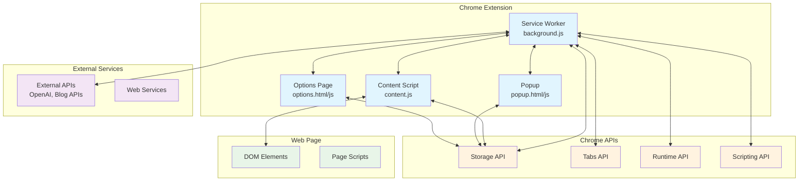
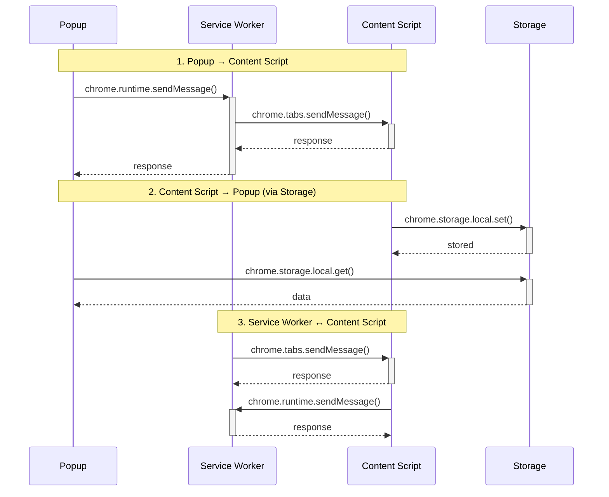
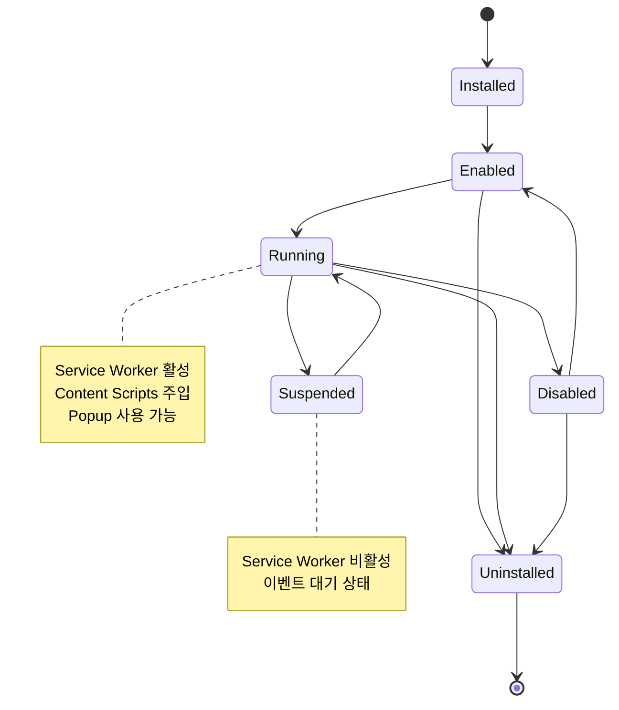
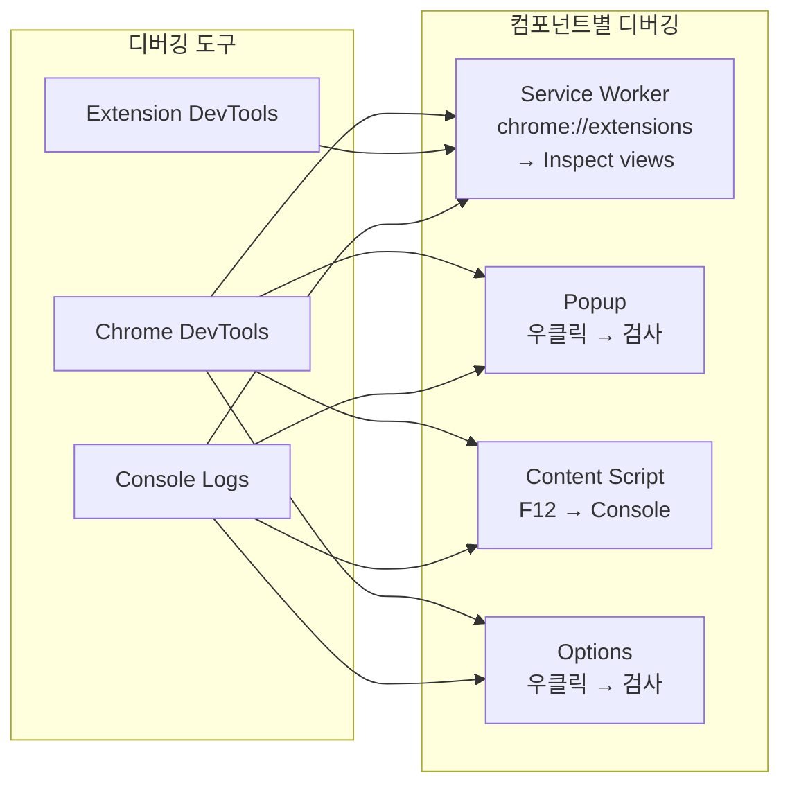
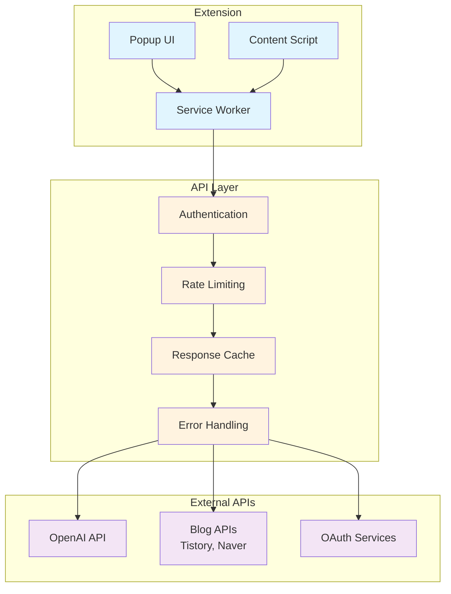
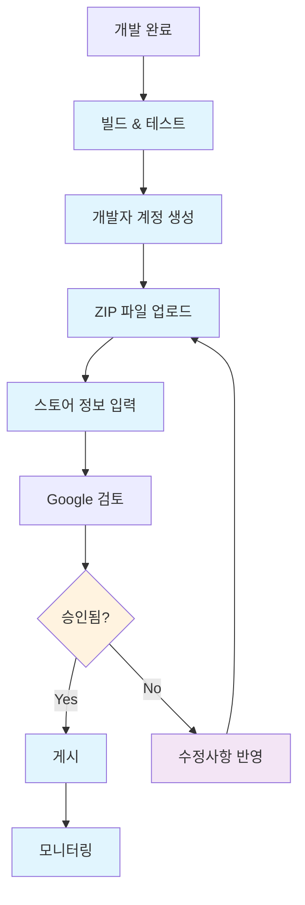
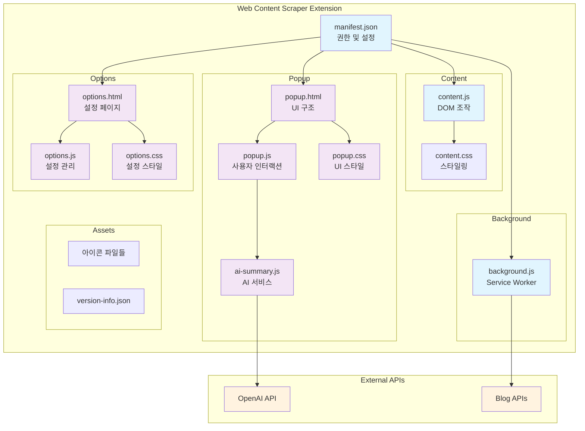

# Chrome Extension 개발 완전 가이드

## 📋 목차
1. [Chrome Extension 기본 구조](#1-chrome-extension-기본-구조)
2. [Manifest.json 상세 설정](#2-manifestjson-상세-설정)
3. [아키텍처와 통신 구조](#3-아키텍처와-통신-구조)
4. [권한 시스템](#4-권한-시스템)
5. [개발 환경 설정](#5-개발-환경-설정)
6. [외부 API 연동](#6-외부-api-연동)
7. [문제 해결 가이드](#7-문제-해결-가이드)
8. [배포 및 스토어 등록](#8-배포-및-스토어-등록)
9. [보안 및 베스트 프랙티스](#9-보안-및-베스트-프랙티스)
10. [실제 프로젝트 예시](#10-실제-프로젝트-예시)

---

## 1. Chrome Extension 기본 구조

### 1.1 파일 구조
```
extension/
├── manifest.json           # 익스텐션 설정 파일 (필수)
├── background/            # Service Worker (백그라운드 스크립트)
│   └── background.js
├── content/              # Content Scripts
│   ├── content.js
│   └── content.css
├── popup/               # 팝업 UI
│   ├── popup.html
│   ├── popup.js
│   └── popup.css
├── options/             # 설정 페이지
│   ├── options.html
│   ├── options.js
│   └── options.css
├── assets/              # 리소스 파일
│   ├── icons/          # 아이콘 (16, 32, 48, 128px)
│   └── images/
├── scripts/             # 빌드 스크립트
│   └── build.js
└── tests/               # 테스트 파일
    └── *.test.js
```

### 1.2 핵심 컴포넌트

#### **📄 Manifest.json**
- 익스텐션의 메타데이터와 설정을 정의
- 권한, 리소스, 스크립트 경로 등을 명시
- Chrome이 익스텐션을 인식하는 진입점

#### **⚙️ Service Worker (Background Script)**
- 백그라운드에서 실행되는 이벤트 기반 스크립트
- API 호출, 데이터 저장, 컨텍스트 메뉴 등을 처리
- 브라우저 종료 후에도 특정 이벤트에 반응

#### **🌐 Content Scripts**
- 웹페이지에 주입되는 스크립트
- DOM 조작, 페이지 데이터 추출 등을 수행
- 웹페이지와 익스텐션 간의 다리 역할

#### **🖼️ Popup**
- 익스텐션 아이콘 클릭 시 표시되는 UI
- 사용자와의 주요 인터랙션 포인트
- 빠른 작업 수행을 위한 인터페이스

#### **⚙️ Options Page**
- 익스텐션 설정을 관리하는 페이지
- chrome://extensions에서 접근 가능
- 복잡한 설정을 위한 전용 페이지

---

## 2. Manifest.json 상세 설정

### 2.1 기본 구조
```json
{
  "manifest_version": 3,
  "name": "Extension Name",
  "version": "1.0.0",
  "description": "Extension description",

  "permissions": [],
  "host_permissions": [],

  "background": {
    "service_worker": "background/background.js"
  },

  "content_scripts": [],
  "action": {},
  "options_page": "options/options.html",
  "icons": {},
  "web_accessible_resources": []
}
```

### 2.2 주요 필드 상세 설명

#### **🔢 manifest_version**
```json
"manifest_version": 3  // Manifest V3 (최신 버전, 필수)
```
- **V2 vs V3**: V3는 보안 강화, Service Worker 사용
- **마이그레이션**: 기존 V2 익스텐션은 V3로 업데이트 필요

#### **🔐 permissions (일반 권한)**
```json
"permissions": [
  "storage",           // Chrome Storage API 사용
  "activeTab",         // 현재 활성 탭 접근 (권장)
  "contextMenus",      // 컨텍스트 메뉴 생성
  "scripting",         // 스크립트 주입 (V3 필수)
  "tabs",              // 탭 정보 접근 (민감)
  "cookies",           // 쿠키 접근 (민감)
  "notifications",     // 시스템 알림 표시
  "alarms",            // 주기적 작업 스케줄링
  "identity",          // OAuth 인증
  "offscreen"          // 오프스크린 문서 (V3)
]
```

#### **🌐 host_permissions (호스트 권한)**
```json
"host_permissions": [
  "https://api.openai.com/*",     // 특정 API 도메인 (권장)
  "https://*.example.com/*",      // 서브도메인 포함
  "http://localhost:*/*",         // 로컬 개발용
  "https://*/*",                  // 모든 HTTPS 사이트 (신중히 사용)
  "<all_urls>"                    // 모든 URL (권장하지 않음)
]
```

#### **📜 content_scripts**
```json
"content_scripts": [
  {
    "matches": ["<all_urls>"],           // 적용할 URL 패턴
    "js": ["content/content.js"],        // 주입할 JS 파일
    "css": ["content/content.css"],      // 주입할 CSS 파일
    "run_at": "document_end",            // 실행 시점
    "all_frames": false,                 // 모든 프레임에 주입 여부
    "exclude_matches": [                 // 제외할 URL
      "*://example.com/*",
      "chrome://*/*"
    ],
    "world": "ISOLATED"                  // 실행 환경 (V3)
  }
]
```

**run_at 옵션:**
- `document_start`: HTML 로드 직후
- `document_end`: DOM 구성 완료 후 (기본값)
- `document_idle`: 페이지 로드 완료 후

#### **🎯 action (팝업 설정)**
```json
"action": {
  "default_popup": "popup/popup.html",
  "default_title": "Extension Title",
  "default_icon": {
    "16": "assets/icons/icon-16.png",
    "32": "assets/icons/icon-32.png",
    "48": "assets/icons/icon-48.png",
    "128": "assets/icons/icon-128.png"
  }
}
```

#### **📁 web_accessible_resources**
```json
"web_accessible_resources": [
  {
    "resources": [
      "assets/images/*",
      "popup/version-info.json",
      "content/injected.js"
    ],
    "matches": ["<all_urls>"]
  }
]
```

### 2.3 보안 설정

#### **🔒 content_security_policy**
```json
"content_security_policy": {
  "extension_pages": "script-src 'self'; object-src 'self'",
  "sandbox": "sandbox allow-scripts; script-src 'self'"
}
```

---

## 3. 아키텍처와 통신 구조

### 3.1 전체 아키텍처 다이어그램

위 다이어그램은 Chrome Extension의 전체 아키텍처와 각 컴포넌트 간의 통신 관계를 보여줍니다.

### 3.2 통신 메커니즘

#### **3.2.1 메시지 전달 방식**

**1️⃣ Popup ↔ Content Script 통신**
```javascript
// Popup에서 Content Script로 메시지 전송
const [tab] = await chrome.tabs.query({ active: true, currentWindow: true });
const response = await chrome.tabs.sendMessage(tab.id, {
  action: 'scrapeFullPage'
});

// Content Script에서 메시지 수신
chrome.runtime.onMessage.addListener((request, sender, sendResponse) => {
  if (request.action === 'scrapeFullPage') {
    const data = scrapePageContent();
    sendResponse({ success: true, data });
  }
  return true; // 비동기 응답을 위해 필요
});
```

**2️⃣ Content Script → Popup 통신 (Storage 기반)**
```javascript
// Content Script에서 데이터 저장
chrome.storage.local.set({
  'selectedData': extractedData,
  'timestamp': Date.now()
});

// Popup에서 데이터 읽기
chrome.storage.local.get(['selectedData', 'timestamp'], (result) => {
  if (result.selectedData) {
    processData(result.selectedData);
  }
});
```

**3️⃣ Service Worker 중앙 집중식 통신**
```javascript
// Service Worker에서 모든 통신 관리
chrome.runtime.onMessage.addListener((message, sender, sendResponse) => {
  switch (message.action) {
    case 'saveToAPI':
      handleAPICall(message.data).then(sendResponse);
      break;
    case 'updateBadge':
      chrome.action.setBadgeText({ text: message.count });
      break;
  }
  return true;
});
```

### 3.3 생명주기 관리



### 3.2 통신 메커니즘

#### **3.2.1 메시지 전달 방식**



#### **3.2.2 Storage 기반 통신**

```javascript
// Content Script에서 데이터 저장
chrome.storage.local.set({
  'selectedData': data,
  'timestamp': Date.now()
});

// Popup에서 데이터 읽기
chrome.storage.local.get(['selectedData', 'timestamp'], (result) => {
  if (result.selectedData) {
    processData(result.selectedData);
  }
});
```

### 3.3 생명주기 관리



---

## 4. 권한 시스템

### 4.1 권한 분류

#### **4.1.1 필수 권한 vs 선택적 권한**

```json
{
  "permissions": [
    "storage",      // 필수: 데이터 저장
    "activeTab"     // 필수: 현재 탭 접근
  ],
  "optional_permissions": [
    "tabs",         // 선택적: 모든 탭 정보
    "cookies"       // 선택적: 쿠키 접근
  ],
  "host_permissions": [
    "https://api.openai.com/*"  // 특정 API 접근
  ],
  "optional_host_permissions": [
    "http://*/*",   // 선택적: 모든 HTTP 사이트
    "https://*/*"   // 선택적: 모든 HTTPS 사이트
  ]
}
```

#### **4.1.2 권한별 용도**

| 권한 | 용도 | 보안 위험도 |
|------|------|-------------|
| `storage` | 로컬 데이터 저장 | 낮음 |
| `activeTab` | 현재 탭만 접근 | 낮음 |
| `tabs` | 모든 탭 정보 접근 | 중간 |
| `<all_urls>` | 모든 웹사이트 접근 | 높음 |
| `cookies` | 쿠키 읽기/쓰기 | 높음 |
| `identity` | OAuth 인증 | 중간 |

### 4.2 동적 권한 요청

```javascript
// 런타임에 권한 요청
async function requestPermissions() {
  const granted = await chrome.permissions.request({
    permissions: ['tabs', 'notifications'],
    origins: ['https://example.com/*']
  });

  if (granted) {
    console.log('권한이 승인되었습니다');
    enableAdvancedFeatures();
  }
}

// 권한 확인
async function checkPermissions() {
  const hasPermission = await chrome.permissions.contains({
    permissions: ['tabs']
  });

  if (hasPermission) {
    // 권한이 있는 경우의 로직
    accessAllTabs();
  }
}
```

---

## 5. 개발 환경 설정

### 5.1 디버깅 방법

#### **5.1.1 각 컴포넌트별 디버깅 위치**

| 컴포넌트 | 디버깅 방법 | 접근 경로 |
|----------|-------------|-----------|
| **Service Worker** | Chrome DevTools | `chrome://extensions` → "검사 뷰" |
| **Popup** | 우클릭 검사 | 팝업 열고 우클릭 → "검사" |
| **Content Script** | 페이지 DevTools | F12 → Console 탭 |
| **Options Page** | 우클릭 검사 | 설정 페이지에서 우클릭 → "검사" |

#### **5.1.2 통합 로깅 시스템**
```javascript
// utils/logger.js
class Logger {
  static log(component, message, data = null) {
    const timestamp = new Date().toISOString();
    const logMessage = `[${timestamp}] [${component}] ${message}`;

    console.log(logMessage, data || '');

    // 개발 환경에서만 상세 로그
    if (process.env.NODE_ENV === 'development') {
      console.trace();
    }
  }

  static error(component, error) {
    console.error(`[${component}] ERROR:`, error);
    // 에러 리포팅 서비스로 전송 (선택사항)
  }
}

// 사용 예시
Logger.log('POPUP', 'User clicked scrape button');
Logger.log('CONTENT', 'Element selected', selectedElement);
Logger.error('BACKGROUND', error);
```

### 5.2 성능 최적화

#### **5.2.1 메모리 관리**
```javascript
// 메모리 누수 방지
class MemoryManager {
  static cleanup() {
    // 이벤트 리스너 정리
    this.removeAllListeners();

    // 타이머 정리
    this.clearAllTimers();

    // 캐시 정리
    this.clearCache();
  }

  static removeAllListeners() {
    // DOM 이벤트 리스너 제거
    document.removeEventListener('click', this.clickHandler);

    // Chrome API 리스너 제거
    chrome.runtime.onMessage.removeListener(this.messageHandler);
  }
}

// 페이지 언로드 시 정리
window.addEventListener('beforeunload', () => {
  MemoryManager.cleanup();
});
```

---

## 6. 외부 API 연동

### 6.1 API 서비스 클래스 설계

```javascript
// services/api-service.js
class APIService {
  constructor(baseURL, apiKey) {
    this.baseURL = baseURL;
    this.apiKey = apiKey;
    this.rateLimiter = new RateLimiter();
  }

  async request(endpoint, options = {}) {
    // Rate limiting 체크
    await this.rateLimiter.wait();

    const url = `${this.baseURL}${endpoint}`;
    const headers = {
      'Authorization': `Bearer ${this.apiKey}`,
      'Content-Type': 'application/json',
      ...options.headers
    };

    try {
      const response = await fetch(url, {
        ...options,
        headers
      });

      if (!response.ok) {
        throw new APIError(response.status, await response.text());
      }

      return await response.json();
    } catch (error) {
      this.handleError(error);
      throw error;
    }
  }

  handleError(error) {
    console.error('API Error:', error);
    // 에러 로깅 및 사용자 알림
  }
}

// OpenAI API 특화 서비스
class OpenAIService extends APIService {
  constructor(apiKey) {
    super('https://api.openai.com/v1', apiKey);
  }

  async generateSummary(content, options = {}) {
    const response = await this.request('/chat/completions', {
      method: 'POST',
      body: JSON.stringify({
        model: 'gpt-3.5-turbo',
        messages: [
          {
            role: 'system',
            content: '한국어 웹 콘텐츠를 요약해주는 어시스턴트입니다.'
          },
          {
            role: 'user',
            content: `다음 내용을 요약해주세요:\n\n${content}`
          }
        ],
        max_tokens: options.maxTokens || 500,
        temperature: 0.7
      })
    });

    return response.choices[0].message.content;
  }
}
```

### 6.2 인증 관리

```javascript
// services/auth-manager.js
class AuthManager {
  // OAuth 인증
  static async authenticateWithGoogle() {
    return new Promise((resolve, reject) => {
      chrome.identity.getAuthToken({ interactive: true }, (token) => {
        if (chrome.runtime.lastError) {
          reject(chrome.runtime.lastError);
        } else {
          resolve(token);
        }
      });
    });
  }

  // API 키 안전 저장
  static async storeAPIKey(service, apiKey) {
    // 간단한 암호화 (실제 프로덕션에서는 더 강력한 암호화 필요)
    const encrypted = btoa(apiKey);
    await chrome.storage.sync.set({
      [`${service}_api_key`]: encrypted
    });
  }

  // API 키 조회
  static async getAPIKey(service) {
    const result = await chrome.storage.sync.get([`${service}_api_key`]);
    const encrypted = result[`${service}_api_key`];
    return encrypted ? atob(encrypted) : null;
  }
}
```

---

## 7. 문제 해결 가이드

### 7.1 일반적인 문제들

#### **7.1.1 권한 관련 문제**

| 문제 | 원인 | 해결방법 |
|------|------|----------|
| `Cannot access chrome://` | 제한된 URL 접근 | `host_permissions`에서 chrome:// 제외 |
| `Extension context invalidated` | 익스텐션 리로드됨 | 에러 핸들링으로 재연결 시도 |
| `Storage quota exceeded` | 저장 공간 초과 | 데이터 정리 로직 구현 |
| `Manifest parsing failed` | JSON 문법 오류 | JSON 유효성 검사 |

#### **7.1.2 통신 문제 해결**

```javascript
// 안전한 메시지 전송
async function sendMessageSafely(tabId, message) {
  try {
    const response = await chrome.tabs.sendMessage(tabId, message);
    return response;
  } catch (error) {
    if (error.message.includes('Could not establish connection')) {
      // Content script가 주입되지 않음
      await chrome.scripting.executeScript({
        target: { tabId },
        files: ['content/content.js']
      });

      // 재시도
      return await chrome.tabs.sendMessage(tabId, message);
    }
    throw error;
  }
}

// Storage 연결 확인
async function checkStorageConnection() {
  try {
    await chrome.storage.local.set({ test: 'connection' });
    await chrome.storage.local.remove(['test']);
    return true;
  } catch (error) {
    console.error('Storage connection failed:', error);
    return false;
  }
}
```

---

## 8. 배포 및 스토어 등록

### 8.1 빌드 및 패키징

```javascript
// scripts/build.js
const fs = require('fs');
const archiver = require('archiver');

class BuildManager {
  static async createDistribution() {
    // 1. 소스 코드 빌드
    await this.buildSource();

    // 2. Manifest 검증
    await this.validateManifest();

    // 3. 압축 파일 생성
    await this.createZip();

    console.log('✅ Distribution package created: extension.zip');
  }

  static async validateManifest() {
    const manifest = JSON.parse(fs.readFileSync('dist/manifest.json', 'utf8'));

    // 필수 필드 확인
    const requiredFields = ['name', 'version', 'manifest_version'];
    for (const field of requiredFields) {
      if (!manifest[field]) {
        throw new Error(`Missing required field: ${field}`);
      }
    }

    // 아이콘 파일 존재 확인
    if (manifest.icons) {
      for (const [size, path] of Object.entries(manifest.icons)) {
        if (!fs.existsSync(`dist/${path}`)) {
          throw new Error(`Icon file not found: ${path}`);
        }
      }
    }
  }

  static async createZip() {
    const output = fs.createWriteStream('extension.zip');
    const archive = archiver('zip', { zlib: { level: 9 } });

    archive.pipe(output);
    archive.directory('dist/', false);
    await archive.finalize();
  }
}
```

### 8.2 Chrome Web Store 등록 체크리스트

#### **📋 등록 전 준비사항**
- [ ] **개발자 계정**: $5 일회성 등록비 결제
- [ ] **아이콘 준비**: 128x128px PNG (고품질)
- [ ] **스크린샷**: 1280x800px 또는 640x400px (최대 5개)
- [ ] **설명 작성**: 한국어/영어 버전 (SEO 최적화)
- [ ] **개인정보 정책**: 데이터 수집 시 필수
- [ ] **카테고리 선택**: 적절한 카테고리 분류

#### **🔍 검토 기준**
- **기능성**: 설명된 기능이 정상 작동하는가?
- **사용자 경험**: 직관적이고 사용하기 쉬운가?
- **보안**: 불필요한 권한 요청하지 않는가?
- **정책 준수**: Google 정책에 위반되지 않는가?

---

## 9. 보안 및 베스트 프랙티스

### 9.1 보안 체크리스트

#### **🔒 데이터 보안**
- [ ] API 키 암호화 저장
- [ ] 사용자 데이터 최소 수집
- [ ] HTTPS 통신만 사용
- [ ] 입력 데이터 검증 및 sanitization
- [ ] XSS 방지 처리

#### **🛡️ 권한 최소화**
- [ ] 필요한 권한만 요청
- [ ] `<all_urls>` 사용 금지
- [ ] 동적 권한 요청 활용
- [ ] 권한 사용 목적 명시

### 9.2 코드 품질

#### **📏 린팅 설정**
```javascript
// .eslintrc.js
module.exports = {
  env: {
    browser: true,
    es2021: true,
    webextensions: true
  },
  extends: [
    'eslint:recommended'
  ],
  rules: {
    'no-console': 'warn',
    'no-unused-vars': 'error',
    'prefer-const': 'error',
    'no-eval': 'error',
    'no-implied-eval': 'error'
  },
  globals: {
    'chrome': 'readonly'
  }
};
```

---

## 10. 실제 프로젝트 예시

### 10.1 현재 프로젝트 구조 분석

우리 프로젝트의 `manifest.json`을 기반으로 실제 구현 사례를 살펴보겠습니다:

```json
{
  "manifest_version": 3,
  "name": "Blog Content Scraper",
  "version": "1.0.0",
  "description": "웹페이지의 콘텐츠를 스크래핑하고 AI 요약을 제공하는 Chrome 익스텐션",

  "permissions": [
    "storage",
    "activeTab",
    "scripting"
  ],

  "host_permissions": [
    "https://api.openai.com/*"
  ],

  "background": {
    "service_worker": "background/background.js"
  },

  "content_scripts": [
    {
      "matches": ["<all_urls>"],
      "js": ["content/content.js"],
      "css": ["content/content.css"],
      "run_at": "document_end"
    }
  ],

  "action": {
    "default_popup": "popup/popup.html",
    "default_title": "Blog Content Scraper",
    "default_icon": {
      "16": "assets/icons/icon-16.png",
      "32": "assets/icons/icon-32.png",
      "48": "assets/icons/icon-48.png",
      "128": "assets/icons/icon-128.png"
    }
  },

  "options_page": "options/options.html",

  "web_accessible_resources": [
    {
      "resources": ["popup/version-info.json"],
      "matches": ["<all_urls>"]
    }
  ]
}
```

### 10.2 주요 기능 구현 패턴

#### **10.2.1 콘텐츠 스크래핑 (T002)**
```javascript
// content/content.js - 선택 기반 스크래핑
class ContentScraper {
  constructor() {
    this.selectedElement = null;
    this.isSelectionMode = false;
  }

  enableSelectionMode() {
    this.isSelectionMode = true;
    document.addEventListener('click', this.handleElementClick, true);
    this.showSelectionUI();
  }

  handleElementClick = (event) => {
    if (!this.isSelectionMode) return;

    event.preventDefault();
    event.stopPropagation();

    this.selectedElement = event.target;
    this.extractAndSave();
  }

  extractAndSave() {
    const data = this.extractElementMetadata(this.selectedElement);

    // Storage를 통한 통신
    chrome.storage.local.set({
      'selectedData': data,
      'selectionComplete': Date.now()
    });

    this.disableSelectionMode();
  }
}
```

#### **10.2.2 AI 요약 기능 (T004)**
```javascript
// popup/ai-summary.js - OpenAI API 연동
class AISummaryService {
  constructor() {
    this.apiKey = null;
    this.baseURL = 'https://api.openai.com/v1';
  }

  async generateSummary(content, options = {}) {
    if (!this.apiKey) {
      throw new Error('API 키가 설정되지 않았습니다');
    }

    const optimizedContent = this.optimizeContent(content);

    const response = await fetch(`${this.baseURL}/chat/completions`, {
      method: 'POST',
      headers: {
        'Authorization': `Bearer ${this.apiKey}`,
        'Content-Type': 'application/json'
      },
      body: JSON.stringify({
        model: 'gpt-3.5-turbo',
        messages: [
          {
            role: 'system',
            content: this.createSystemPrompt(options)
          },
          {
            role: 'user',
            content: `다음 내용을 요약해주세요:\n\n${optimizedContent}`
          }
        ],
        max_tokens: this.getMaxTokens(options.length),
        temperature: 0.7
      })
    });

    if (!response.ok) {
      throw new Error(`API 요청 실패: ${response.status}`);
    }

    const data = await response.json();
    return data.choices[0].message.content;
  }
}
```

### 10.3 학습 포인트

#### **10.3.1 성공 요인**
- **최소 권한 원칙**: `activeTab` 사용으로 사용자 신뢰 확보
- **Storage 기반 통신**: 안정적인 데이터 전달
- **타임스탬프 기반 동기화**: 폴링 없는 효율적 통신
- **에러 핸들링**: 사용자 친화적 오류 메시지

#### **10.3.2 개선 과정**
1. **초기 문제**: 메시지 전달 실패
2. **해결 방안**: Storage 기반 통신으로 전환
3. **추가 개선**: 타임스탬프로 중복 처리 방지
4. **최종 결과**: 안정적인 선택 기능 구현

### 10.4 배포 준비

#### **10.4.1 빌드 스크립트 활용**
```bash
# 개발 빌드
npm run build:dev

# 프로덕션 빌드 (압축 포함)
npm run build

# 버전 정보 생성
npm run version
```

#### **10.4.2 테스트 전략**
```javascript
// tests/e2e/basic-extension.test.js
const { test, expect } = require('@playwright/test');

test('익스텐션 기본 기능 테스트', async ({ page, context }) => {
  // 익스텐션 로드
  await context.addInitScript(() => {
    // Mock Chrome APIs
    window.chrome = {
      storage: { local: { get: () => {}, set: () => {} } },
      runtime: { sendMessage: () => {} }
    };
  });

  await page.goto('https://example.com');

  // 팝업 테스트
  const popup = await page.locator('[data-testid="extension-popup"]');
  await expect(popup).toBeVisible();

  // 스크래핑 기능 테스트
  await page.click('[data-testid="scrape-button"]');
  await expect(page.locator('.scraping-indicator')).toBeVisible();
});
```

---

## 📚 추가 리소스

### 공식 문서
- [Chrome Extensions Developer Guide](https://developer.chrome.com/docs/extensions/)
- [Manifest V3 마이그레이션 가이드](https://developer.chrome.com/docs/extensions/migrating/)
- [Chrome Extensions API Reference](https://developer.chrome.com/docs/extensions/reference/)

### 유용한 도구
- **Chrome Extension Source Viewer**: 다른 익스텐션 소스 코드 분석
- **Extension Reloader**: 개발 중 자동 리로드
- **Chrome DevTools**: 디버깅 및 성능 분석

### 커뮤니티
- [Chrome Extensions Google Group](https://groups.google.com/a/chromium.org/g/chromium-extensions)
- [Stack Overflow - Chrome Extension 태그](https://stackoverflow.com/questions/tagged/google-chrome-extension)

---

## 🎯 마무리

이 가이드는 Chrome Extension 개발의 전체 과정을 다루고 있습니다. 실제 프로젝트를 통해 얻은 경험과 베스트 프랙티스를 바탕으로 작성되었으며, 초보자부터 고급 개발자까지 참고할 수 있는 내용을 포함하고 있습니다.

### 핵심 요약
1. **Manifest V3** 사용 필수
2. **최소 권한 원칙** 준수
3. **Storage 기반 통신** 활용
4. **사용자 경험** 최우선
5. **보안** 항상 고려
6. **테스트** 철저히 수행

Chrome Extension 개발 시 이 가이드를 참고하여 안정적이고 사용자 친화적인 익스텐션을 만들어보세요! 🚀

---

*마지막 업데이트: 2025년 1월*

## 5. 개발 환경 설정

### 5.1 개발 도구 설정

#### **5.1.1 기본 도구**
```json
{
  "devDependencies": {
    "webpack": "^5.0.0",
    "webpack-cli": "^4.0.0",
    "babel-loader": "^8.0.0",
    "@babel/core": "^7.0.0",
    "@babel/preset-env": "^7.0.0",
    "css-loader": "^6.0.0",
    "style-loader": "^3.0.0",
    "copy-webpack-plugin": "^9.0.0",
    "eslint": "^8.0.0",
    "prettier": "^2.0.0"
  }
}
```

#### **5.1.2 Webpack 설정**
```javascript
// webpack.config.js
const path = require('path');
const CopyPlugin = require('copy-webpack-plugin');

module.exports = {
  mode: 'development',
  entry: {
    background: './background/background.js',
    content: './content/content.js',
    popup: './popup/popup.js',
    options: './options/options.js'
  },
  output: {
    path: path.resolve(__dirname, 'dist'),
    filename: '[name]/[name].js'
  },
  plugins: [
    new CopyPlugin({
      patterns: [
        { from: 'manifest.json', to: 'manifest.json' },
        { from: 'popup/popup.html', to: 'popup/popup.html' },
        { from: 'options/options.html', to: 'options/options.html' },
        { from: 'assets', to: 'assets' }
      ]
    })
  ]
};
```

### 5.2 디버깅 방법

#### **5.2.1 각 컴포넌트별 디버깅**



#### **5.2.2 로깅 시스템**
```javascript
// 통합 로깅 시스템
class Logger {
  static log(component, message, data = null) {
    const timestamp = new Date().toISOString();
    const logMessage = `[${timestamp}] [${component}] ${message}`;

    console.log(logMessage, data || '');

    // 개발 환경에서만 상세 로그
    if (process.env.NODE_ENV === 'development') {
      console.trace();
    }
  }

  static error(component, error) {
    console.error(`[${component}] ERROR:`, error);
  }
}

// 사용 예시
Logger.log('POPUP', 'User clicked scrape button');
Logger.log('CONTENT', 'Element selected', selectedElement);
Logger.error('BACKGROUND', error);
```

---

## 6. 외부 API 연동

### 6.1 API 통신 아키텍처



### 6.2 API 서비스 클래스

```javascript
// API 기본 클래스
class APIService {
  constructor(baseURL, apiKey) {
    this.baseURL = baseURL;
    this.apiKey = apiKey;
    this.rateLimiter = new RateLimiter();
  }

  async request(endpoint, options = {}) {
    // Rate limiting 체크
    await this.rateLimiter.wait();

    const url = `${this.baseURL}${endpoint}`;
    const headers = {
      'Authorization': `Bearer ${this.apiKey}`,
      'Content-Type': 'application/json',
      ...options.headers
    };

    try {
      const response = await fetch(url, {
        ...options,
        headers
      });

      if (!response.ok) {
        throw new APIError(response.status, await response.text());
      }

      return await response.json();
    } catch (error) {
      this.handleError(error);
      throw error;
    }
  }

  handleError(error) {
    console.error('API Error:', error);
    // 에러 로깅 및 사용자 알림
  }
}

// OpenAI API 서비스
class OpenAIService extends APIService {
  constructor(apiKey) {
    super('https://api.openai.com/v1', apiKey);
  }

  async generateSummary(content, options = {}) {
    const response = await this.request('/chat/completions', {
      method: 'POST',
      body: JSON.stringify({
        model: 'gpt-3.5-turbo',
        messages: [
          {
            role: 'system',
            content: '한국어 웹 콘텐츠를 요약해주는 어시스턴트입니다.'
          },
          {
            role: 'user',
            content: `다음 내용을 요약해주세요:\n\n${content}`
          }
        ],
        max_tokens: options.maxTokens || 500,
        temperature: 0.7
      })
    });

    return response.choices[0].message.content;
  }
}
```

### 6.3 인증 관리

```javascript
// OAuth 인증 플로우
class AuthManager {
  static async authenticateWithGoogle() {
    return new Promise((resolve, reject) => {
      chrome.identity.getAuthToken({ interactive: true }, (token) => {
        if (chrome.runtime.lastError) {
          reject(chrome.runtime.lastError);
        } else {
          resolve(token);
        }
      });
    });
  }

  static async storeAPIKey(service, apiKey) {
    // 암호화하여 저장
    const encrypted = await this.encrypt(apiKey);
    await chrome.storage.sync.set({
      [`${service}_api_key`]: encrypted
    });
  }

  static async getAPIKey(service) {
    const result = await chrome.storage.sync.get([`${service}_api_key`]);
    const encrypted = result[`${service}_api_key`];
    return encrypted ? await this.decrypt(encrypted) : null;
  }
}
```

---

## 7. 문제 해결 가이드

### 7.1 일반적인 문제들

#### **7.1.1 권한 관련 문제**

| 문제 | 원인 | 해결방법 |
|------|------|----------|
| `Cannot access chrome://` | 제한된 URL 접근 | `host_permissions`에서 제외 |
| `Extension context invalidated` | 익스텐션 리로드됨 | 에러 핸들링 추가 |
| `Storage quota exceeded` | 저장 공간 초과 | 데이터 정리 로직 구현 |

#### **7.1.2 통신 문제**

```javascript
// 메시지 전송 실패 처리
async function sendMessageSafely(tabId, message) {
  try {
    const response = await chrome.tabs.sendMessage(tabId, message);
    return response;
  } catch (error) {
    if (error.message.includes('Could not establish connection')) {
      // Content script가 주입되지 않음
      await chrome.scripting.executeScript({
        target: { tabId },
        files: ['content/content.js']
      });

      // 재시도
      return await chrome.tabs.sendMessage(tabId, message);
    }
    throw error;
  }
}
```

### 7.2 성능 최적화

#### **7.2.1 메모리 관리**

```javascript
// 메모리 누수 방지
class MemoryManager {
  static cleanup() {
    // 이벤트 리스너 정리
    this.removeAllListeners();

    // 타이머 정리
    this.clearAllTimers();

    // 캐시 정리
    this.clearCache();
  }

  static removeAllListeners() {
    // DOM 이벤트 리스너 제거
    document.removeEventListener('click', this.clickHandler);

    // Chrome API 리스너 제거
    chrome.runtime.onMessage.removeListener(this.messageHandler);
  }
}

// 페이지 언로드 시 정리
window.addEventListener('beforeunload', () => {
  MemoryManager.cleanup();
});
```

#### **7.2.2 배치 처리**

```javascript
// 대량 데이터 처리
class BatchProcessor {
  static async processBatch(items, batchSize = 10) {
    const results = [];

    for (let i = 0; i < items.length; i += batchSize) {
      const batch = items.slice(i, i + batchSize);
      const batchResults = await Promise.all(
        batch.map(item => this.processItem(item))
      );
      results.push(...batchResults);

      // 다음 배치 전 잠시 대기 (CPU 부하 방지)
      await new Promise(resolve => setTimeout(resolve, 100));
    }

    return results;
  }
}
```

---

## 8. 배포 및 스토어 등록

### 8.1 배포 준비

#### **8.1.1 빌드 스크립트**
```javascript
// scripts/build.js
const fs = require('fs');
const path = require('path');
const archiver = require('archiver');

class BuildManager {
  static async build() {
    // 1. 소스 코드 빌드
    await this.buildSource();

    // 2. 에셋 복사
    await this.copyAssets();

    // 3. Manifest 검증
    await this.validateManifest();

    // 4. 압축 파일 생성
    await this.createZip();
  }

  static async createZip() {
    const output = fs.createWriteStream('extension.zip');
    const archive = archiver('zip', { zlib: { level: 9 } });

    archive.directory('dist/', false);
    archive.finalize();
  }
}
```

### 8.2 Chrome Web Store 등록

#### **8.2.1 등록 프로세스**



#### **8.2.2 스토어 정보 준비**
- **아이콘**: 128x128px PNG (고품질)
- **스크린샷**: 1280x800px 또는 640x400px
- **설명**: 한국어/영어 버전
- **개인정보 정책**: 필수 (데이터 수집 시)

---

## 9. 보안 및 베스트 프랙티스

### 9.1 보안 체크리스트

#### **9.1.1 데이터 보안**
- [ ] API 키 암호화 저장
- [ ] 사용자 데이터 최소 수집
- [ ] HTTPS 통신만 사용
- [ ] 입력 데이터 검증
- [ ] XSS 방지 처리

#### **9.1.2 권한 최소화**
- [ ] 필요한 권한만 요청
- [ ] `<all_urls>` 사용 금지
- [ ] 동적 권한 요청 활용
- [ ] 권한 사용 목적 명시

### 9.2 코드 품질

#### **9.2.1 린팅 설정**
```javascript
// .eslintrc.js
module.exports = {
  env: {
    browser: true,
    es2021: true,
    webextensions: true
  },
  extends: [
    'eslint:recommended'
  ],
  rules: {
    'no-console': 'warn',
    'no-unused-vars': 'error',
    'prefer-const': 'error'
  },
  globals: {
    'chrome': 'readonly'
  }
};
```

#### **9.2.2 테스트 코드**
```javascript
// tests/content.test.js
describe('Content Script', () => {
  test('should extract text content', () => {
    const mockElement = {
      textContent: 'Test content',
      innerHTML: '<p>Test content</p>'
    };

    const scraper = new ContentScraper();
    const result = scraper.extractTextContent(mockElement);

    expect(result).toBe('Test content');
  });
});
```

---

## 10. 실제 프로젝트 예시

### 10.1 현재 프로젝트 구조



### 10.2 주요 기능별 구현

#### **10.2.1 콘텐츠 스크래핑**
```javascript
// content/content.js - 핵심 기능
class ContentScraper {
  async scrapeFullPage() {
    // 16개 한국 사이트 특화 셀렉터
    const contentSelectors = [
      '.view_text',           // 네이버 블로그
      '.se-main-container',   // 네이버 스마트에디터
      '.article_view',        // 티스토리
      // ... 더 많은 셀렉터
    ];

    // 메타데이터, 이미지, 링크 추출
    return {
      title, url, content,
      metadata, images, links,
      timestamp, wordCount
    };
  }
}
```

#### **10.2.2 AI 요약 기능**
```javascript
// popup/ai-summary.js
class AISummaryService {
  async generateSummary(content, options) {
    const response = await this.openai.request('/chat/completions', {
      model: 'gpt-3.5-turbo',
      messages: this.buildPrompt(content, options),
      max_tokens: this.calculateTokens(options.length)
    });

    return this.formatResponse(response, options);
  }
}
```

---

## 참고 자료

### 공식 문서
- [Chrome Extension Developer Guide](https://developer.chrome.com/docs/extensions/)
- [Manifest V3 Migration](https://developer.chrome.com/docs/extensions/migrating/)
- [Chrome Extension APIs](https://developer.chrome.com/docs/extensions/reference/)

### 유용한 도구
- [Extension Reloader](https://chrome.google.com/webstore/detail/extensions-reloader/fimgfedafeadlieiabdeeaodndnlbhid)
- [React Developer Tools](https://chrome.google.com/webstore/detail/react-developer-tools/fmkadmapgofadopljbjfkapdkoienihi)
- [Chrome Extension Source Viewer](https://chrome.google.com/webstore/detail/chrome-extension-source-v/jifpbeccnghkjeaalbbjmodiffmgedin)

### 커뮤니티
- [Stack Overflow - Chrome Extension](https://stackoverflow.com/questions/tagged/google-chrome-extension)
- [Reddit - Chrome Extensions](https://www.reddit.com/r/chrome_extensions/)
- [Chrome Extension Discord](https://discord.gg/chrome-extensions)

---

*이 문서는 Chrome Extension 개발의 모든 측면을 다루는 포괄적인 가이드입니다. 프로젝트의 요구사항에 따라 필요한 섹션을 참조하여 사용하세요.*
