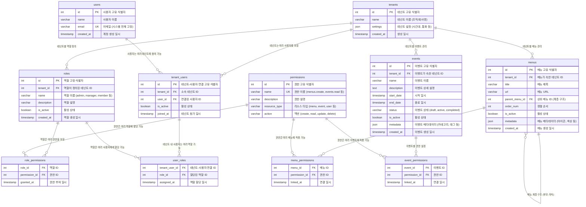
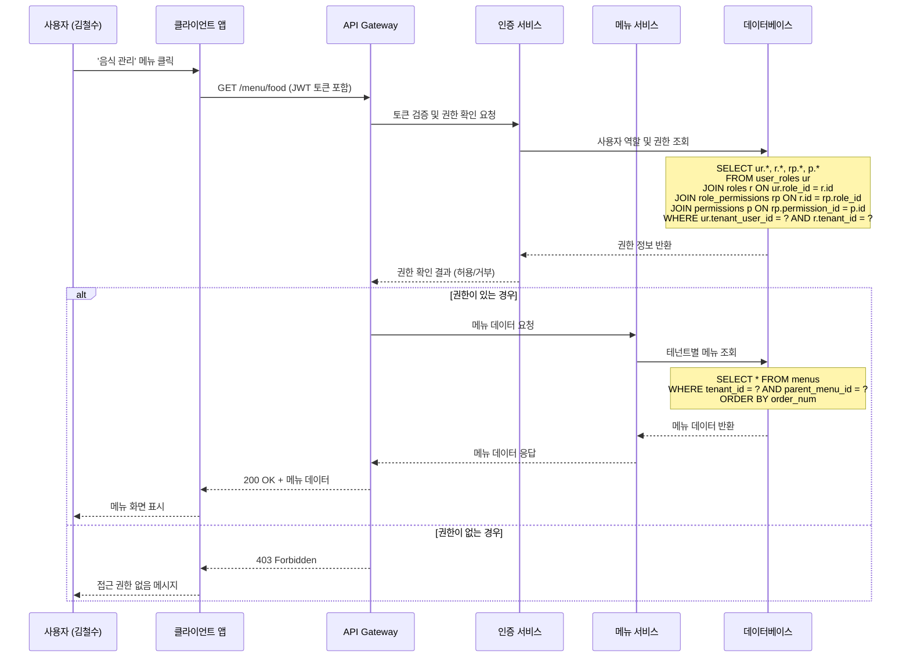
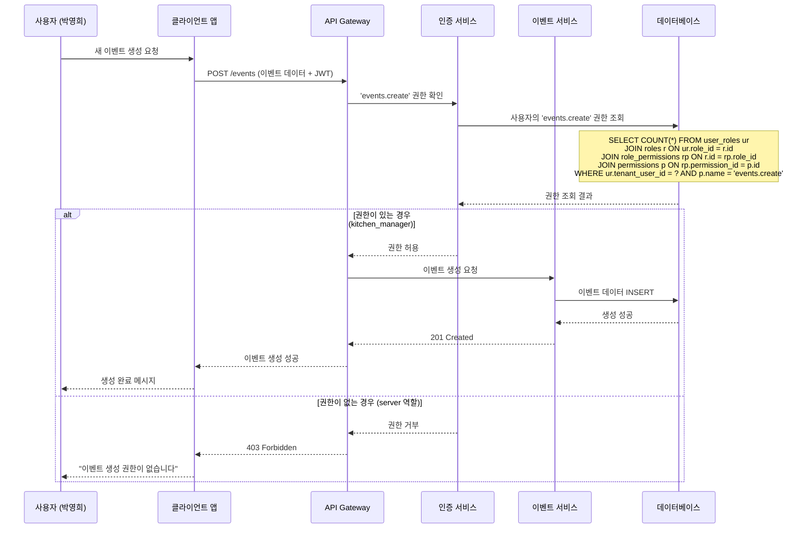
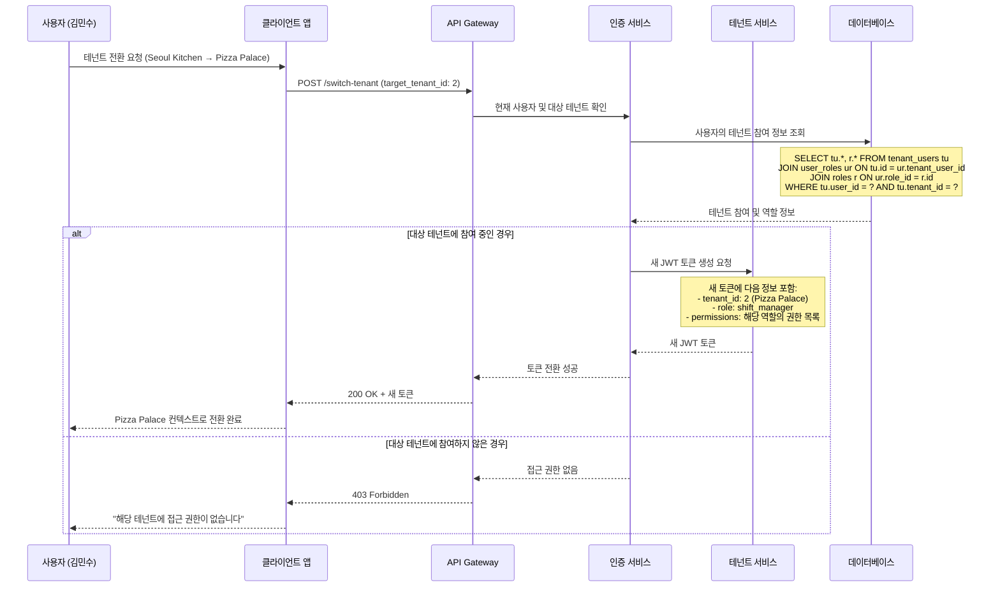
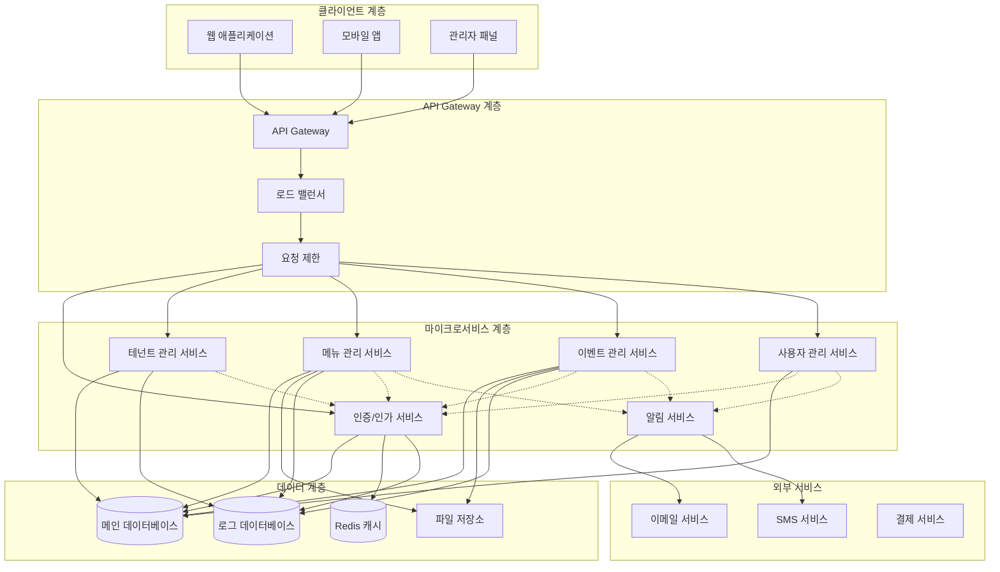

# 멀티테넌트 RBAC 시스템의 메뉴 및 이벤트 관리 구조

멀티테넌트 RBAC 시스템에서 메뉴와 이벤트 같은 리소스 관리는 테넌트 격리, 역할 기반 권한 제어, 그리고 동적 리소스 관리를 모두 고려해야 하는 복잡한 시스템입니다. 이를 체계적으로 설계하기 위해 여러 다이어그램과 실제 시드 데이터를 통해 상세히 설명드리겠습니다.

## 1. 확장된 멀티테넌트 RBAC ERD 구조

기본 멀티테넌트 RBAC 구조에 리소스 관리 기능을 추가한 완전한 ERD입니다.


멀티테넌트 RBAC 시스템의 메뉴 및 이벤트 관리 ERD




## 2. 리소스 관리 시나리오별 시드 데이터

### 시나리오: 'FoodieHub' 레스토랑 관리 SaaS 플랫폼

**테넌트 구성:**

- 'Seoul Kitchen' (한식 레스토랑)
- 'Pizza Palace' (이탈리안 레스토랑)
- 'Sushi Master' (일식 레스토랑)

```sql
-- ### 1. 테넌트 및 사용자 기본 데이터 ###
INSERT INTO tenants (id, name, settings, created_at) VALUES
(1, 'Seoul Kitchen', '{"timezone": "Asia/Seoul", "currency": "KRW", "language": "ko"}', NOW()),
(2, 'Pizza Palace', '{"timezone": "America/New_York", "currency": "USD", "language": "en"}', NOW()),
(3, 'Sushi Master', '{"timezone": "Asia/Tokyo", "currency": "JPY", "language": "ja"}', NOW());

-- 사용자 생성 (전체 시스템 사용자)
INSERT INTO users (id, name, email, created_at) VALUES
(101, '김철수', 'kim.cheolsu@example.com', NOW()),       -- Seoul Kitchen 관리자
(102, '박영희', 'park.younghee@example.com', NOW()),     -- Seoul Kitchen 직원
(103, 'John Smith', 'john.smith@example.com', NOW()),     -- Pizza Palace 관리자
(104, 'Maria Garcia', 'maria.garcia@example.com', NOW()), -- Pizza Palace 직원
(105, '田中太郎', 'tanaka.taro@example.com', NOW()),       -- Sushi Master 관리자
(106, '김민수', 'kim.minsu@example.com', NOW());          -- 멀티테넌트 컨설턴트

-- 테넌트-사용자 연결 (멀티테넌트 참여 포함)
INSERT INTO tenant_users (id, tenant_id, user_id, is_active, joined_at) VALUES
(1, 1, 101, true, NOW()),  -- 김철수 → Seoul Kitchen
(2, 1, 102, true, NOW()),  -- 박영희 → Seoul Kitchen
(3, 2, 103, true, NOW()),  -- John Smith → Pizza Palace
(4, 2, 104, true, NOW()),  -- Maria Garcia → Pizza Palace
(5, 3, 105, true, NOW()),  -- 田中太郎 → Sushi Master
(6, 1, 106, true, NOW()),  -- 김민수 → Seoul Kitchen (컨설턴트)
(7, 2, 106, true, NOW());  -- 김민수 → Pizza Palace (컨설턴트)

-- ### 2. 권한 정의 (시스템 전체 권한) ###
INSERT INTO permissions (id, name, description, resource_type, action) VALUES
-- 메뉴 관리 권한
(10, 'menus.create', '메뉴 생성 권한', 'menu', 'create'),
(11, 'menus.read', '메뉴 조회 권한', 'menu', 'read'),
(12, 'menus.update', '메뉴 수정 권한', 'menu', 'update'),
(13, 'menus.delete', '메뉴 삭제 권한', 'menu', 'delete'),
-- 이벤트 관리 권한
(14, 'events.create', '이벤트 생성 권한', 'event', 'create'),
(15, 'events.read', '이벤트 조회 권한', 'event', 'read'),
(16, 'events.update', '이벤트 수정 권한', 'event', 'update'),
(17, 'events.delete', '이벤트 삭제 권한', 'event', 'delete'),
-- 사용자 관리 권한
(18, 'users.invite', '사용자 초대 권한', 'user', 'invite'),
(19, 'users.manage', '사용자 관리 권한', 'user', 'manage'),
-- 보고서 권한
(20, 'reports.read', '보고서 조회 권한', 'report', 'read'),
(21, 'analytics.read', '분석 데이터 조회 권한', 'analytics', 'read');

-- ### 3. 테넌트별 역할 정의 ###
INSERT INTO roles (id, tenant_id, name, description, is_active, created_at) VALUES
-- Seoul Kitchen 역할
(1, 1, 'restaurant_owner', '레스토랑 소유자 (모든 권한)', true, NOW()),
(2, 1, 'kitchen_manager', '주방 관리자 (메뉴 관리 + 이벤트 관리)', true, NOW()),
(3, 1, 'server', '서빙 직원 (메뉴 조회 + 이벤트 조회)', true, NOW()),
-- Pizza Palace 역할
(4, 2, 'franchise_owner', '프랜차이즈 소유자 (모든 권한)', true, NOW()),
(5, 2, 'shift_manager', '교대 관리자 (메뉴 수정 + 이벤트 관리)', true, NOW()),
(6, 2, 'cashier', '계산원 (메뉴 조회 + 이벤트 조회)', true, NOW()),
-- Sushi Master 역할
(7, 3, 'head_chef', '수석 셰프 (메뉴 관리 + 이벤트 관리)', true, NOW()),
(8, 3, 'sous_chef', '부셰프 (메뉴 수정 + 이벤트 조회)', true, NOW());

-- ### 4. 역할-권한 매핑 ###
INSERT INTO role_permissions (role_id, permission_id, granted_at) VALUES
-- restaurant_owner (Seoul Kitchen) - 모든 권한
(1, 10), (1, 11), (1, 12), (1, 13), (1, 14), (1, 15), (1, 16), (1, 17), (1, 18), (1, 19), (1, 20), (1, 21),
-- kitchen_manager (Seoul Kitchen) - 메뉴 + 이벤트 관리
(2, 10), (2, 11), (2, 12), (2, 13), (2, 14), (2, 15), (2, 16), (2, 17), (2, 20),
-- server (Seoul Kitchen) - 조회 권한만
(3, 11), (3, 15),
-- franchise_owner (Pizza Palace) - 모든 권한
(4, 10), (4, 11), (4, 12), (4, 13), (4, 14), (4, 15), (4, 16), (4, 17), (4, 18), (4, 19), (4, 20), (4, 21),
-- shift_manager (Pizza Palace) - 메뉴 수정 + 이벤트 관리
(5, 11), (5, 12), (5, 14), (5, 15), (5, 16), (5, 17), (5, 20),
-- cashier (Pizza Palace) - 조회 권한만
(6, 11), (6, 15),
-- head_chef (Sushi Master) - 메뉴 + 이벤트 관리
(7, 10), (7, 11), (7, 12), (7, 13), (7, 14), (7, 15), (7, 16), (7, 17), (7, 20),
-- sous_chef (Sushi Master) - 메뉴 수정 + 이벤트 조회
(8, 11), (8, 12), (8, 15);

-- ### 5. 사용자-역할 할당 ###
INSERT INTO user_roles (tenant_user_id, role_id, assigned_at) VALUES
(1, 1, NOW()),  -- 김철수 → restaurant_owner (Seoul Kitchen)
(2, 3, NOW()),  -- 박영희 → server (Seoul Kitchen)
(3, 4, NOW()),  -- John Smith → franchise_owner (Pizza Palace)
(4, 6, NOW()),  -- Maria Garcia → cashier (Pizza Palace)
(5, 7, NOW()),  -- 田中太郎 → head_chef (Sushi Master)
(6, 2, NOW()),  -- 김민수 → kitchen_manager (Seoul Kitchen, 컨설턴트)
(7, 5, NOW());  -- 김민수 → shift_manager (Pizza Palace, 컨설턴트)

-- ### 6. 메뉴 리소스 데이터 (계층 구조 포함) ###
INSERT INTO menus (id, tenant_id, title, url, parent_menu_id, order_num, is_active, metadata, created_at) VALUES
-- Seoul Kitchen 메뉴
(1, 1, '메인 메뉴', '/main', NULL, 1, true, '{"icon": "home", "color": "#ff6b6b"}', NOW()),
(2, 1, '음식 관리', '/food', NULL, 2, true, '{"icon": "utensils", "color": "#4ecdc4"}', NOW()),
(3, 1, '한식', '/food/korean', 2, 1, true, '{"icon": "bowl", "color": "#45b7d1"}', NOW()),
(4, 1, '분식', '/food/snack', 2, 2, true, '{"icon": "cookie", "color": "#f9ca24"}', NOW()),
(5, 1, '이벤트 관리', '/events', NULL, 3, true, '{"icon": "calendar", "color": "#6c5ce7"}', NOW()),

-- Pizza Palace 메뉴
(6, 2, 'Dashboard', '/dashboard', NULL, 1, true, '{"icon": "dashboard", "color": "#e74c3c"}', NOW()),
(7, 2, 'Menu Management', '/menu', NULL, 2, true, '{"icon": "pizza", "color": "#2ecc71"}', NOW()),
(8, 2, 'Pizza', '/menu/pizza', 7, 1, true, '{"icon": "pizza-slice", "color": "#f39c12"}', NOW()),
(9, 2, 'Beverages', '/menu/beverages', 7, 2, true, '{"icon": "glass", "color": "#3498db"}', NOW()),
(10, 2, 'Promotions', '/promotions', NULL, 3, true, '{"icon": "percentage", "color": "#9b59b6"}', NOW()),

-- Sushi Master 메뉴
(11, 3, 'ダッシュボード', '/dashboard', NULL, 1, true, '{"icon": "dashboard", "color": "#1abc9c"}', NOW()),
(12, 3, 'メニュー管理', '/menu', NULL, 2, true, '{"icon": "fish", "color": "#e67e22"}', NOW()),
(13, 3, '寿司', '/menu/sushi', 12, 1, true, '{"icon": "sushi", "color": "#34495e"}', NOW()),
(14, 3, '刺身', '/menu/sashimi', 12, 2, true, '{"icon": "fish", "color": "#95a5a6"}', NOW());

-- ### 7. 이벤트 리소스 데이터 ###
INSERT INTO events (id, tenant_id, name, description, start_date, end_date, status, is_active, metadata, created_at) VALUES
-- Seoul Kitchen 이벤트
(1, 1, '추석 특별 메뉴', '추석 연휴 기간 한정 특별 메뉴 출시', '2025-09-15 00:00:00', '2025-09-17 23:59:59', 'active', true, '{"category": "seasonal", "tags": ["추석", "전통음식"]}', NOW()),
(2, 1, '신규 오픈 이벤트', '신규 고객 대상 20% 할인 이벤트', '2025-07-20 00:00:00', '2025-08-20 23:59:59', 'active', true, '{"category": "promotion", "tags": ["할인", "신규고객"]}', NOW()),

-- Pizza Palace 이벤트
(3, 2, 'Summer Pizza Festival', '여름 한정 피자 메뉴 축제', '2025-06-01 00:00:00', '2025-08-31 23:59:59', 'active', true, '{"category": "seasonal", "tags": ["summer", "festival"]}', NOW()),
(4, 2, 'Family Package Deal', '가족 단위 고객 대상 패키지 할인', '2025-07-01 00:00:00', '2025-07-31 23:59:59', 'active', true, '{"category": "promotion", "tags": ["family", "discount"]}', NOW()),

-- Sushi Master 이벤트
(5, 3, '夏の特別コース', '여름 한정 특별 코스 메뉴', '2025-06-15 00:00:00', '2025-08-15 23:59:59', 'active', true, '{"category": "seasonal", "tags": ["夏", "特別コース"]}', NOW()),
(6, 3, '新鮮マグロフェア', '신선한 참치 페어', '2025-07-01 00:00:00', '2025-07-31 23:59:59', 'active', true, '{"category": "ingredient", "tags": ["マグロ", "新鮮"]}', NOW());

-- ### 8. 리소스별 권한 연결 ###
-- 메뉴-권한 연결 (특정 메뉴에 특정 권한 필요)
INSERT INTO menu_permissions (menu_id, permission_id, linked_at) VALUES
-- Seoul Kitchen 메뉴 권한
(2, 10, NOW()),  -- 음식 관리 메뉴 → menus.create 권한 필요
(2, 12, NOW()),  -- 음식 관리 메뉴 → menus.update 권한 필요
(5, 14, NOW()),  -- 이벤트 관리 메뉴 → events.create 권한 필요
(5, 16, NOW()),  -- 이벤트 관리 메뉴 → events.update 권한 필요
-- Pizza Palace 메뉴 권한
(7, 10, NOW()),  -- Menu Management → menus.create 권한 필요
(7, 12, NOW()),  -- Menu Management → menus.update 권한 필요
(10, 14, NOW()), -- Promotions → events.create 권한 필요
(10, 16, NOW()), -- Promotions → events.update 권한 필요
-- Sushi Master 메뉴 권한
(12, 10, NOW()), -- メニュー管理 → menus.create 권한 필요
(12, 12, NOW()); -- メニュー管理 → menus.update 권한 필요

-- 이벤트-권한 연결 (특정 이벤트에 특정 권한 필요)
INSERT INTO event_permissions (event_id, permission_id, linked_at) VALUES
-- Seoul Kitchen 이벤트 권한
(1, 16, NOW()),  -- 추석 특별 메뉴 → events.update 권한 필요
(2, 16, NOW()),  -- 신규 오픈 이벤트 → events.update 권한 필요
-- Pizza Palace 이벤트 권한
(3, 16, NOW()),  -- Summer Pizza Festival → events.update 권한 필요
(4, 16, NOW()),  -- Family Package Deal → events.update 권한 필요
-- Sushi Master 이벤트 권한
(5, 16, NOW()),  -- 夏の特別コース → events.update 권한 필요
(6, 16, NOW());  -- 新鮮マグロフェア → events.update 권한 필요
```


## 3. 시스템 동작 시나리오별 다이어그램

### 시나리오 1: 메뉴 접근 권한 확인 시퀀스




### 시나리오 2: 이벤트 생성 권한 확인 및 생성 과정




### 시나리오 3: 멀티테넌트 사용자의 컨텍스트 전환




## 4. 시스템 아키텍처 컴포넌트 다이어그램




## 5. 데이터베이스 권한 확인 쿼리 예시

### 복합 권한 확인 쿼리

```sql
-- 사용자가 특정 테넌트에서 특정 메뉴에 접근할 수 있는지 확인
WITH user_permissions AS (
    SELECT DISTINCT p.name as permission_name, p.resource_type, p.action
    FROM users u
    JOIN tenant_users tu ON u.id = tu.user_id
    JOIN user_roles ur ON tu.id = ur.tenant_user_id
    JOIN roles r ON ur.role_id = r.id
    JOIN role_permissions rp ON r.id = rp.role_id
    JOIN permissions p ON rp.permission_id = p.id
    WHERE u.email = :user_email 
      AND tu.tenant_id = :tenant_id
      AND tu.is_active = true
      AND r.is_active = true
),
menu_required_permissions AS (
    SELECT DISTINCT p.name as permission_name
    FROM menus m
    JOIN menu_permissions mp ON m.id = mp.menu_id
    JOIN permissions p ON mp.permission_id = p.id
    WHERE m.id = :menu_id
      AND m.tenant_id = :tenant_id
      AND m.is_active = true
)
SELECT 
    CASE 
        WHEN COUNT(mrp.permission_name) = 0 THEN 'ALLOWED'  -- 메뉴에 특별한 권한이 필요하지 않음
        WHEN COUNT(mrp.permission_name) = COUNT(up.permission_name) THEN 'ALLOWED'  -- 모든 필요 권한 보유
        ELSE 'DENIED'  -- 일부 권한 부족
    END as access_result,
    COALESCE(ARRAY_AGG(mrp.permission_name ORDER BY mrp.permission_name), '{}') as required_permissions,
    COALESCE(ARRAY_AGG(up.permission_name ORDER BY up.permission_name), '{}') as user_permissions
FROM menu_required_permissions mrp
LEFT JOIN user_permissions up ON mrp.permission_name = up.permission_name;
```


### 테넌트별 리소스 통계 쿼리

```sql
-- 테넌트별 리소스 및 권한 통계
SELECT 
    t.name as tenant_name,
    COUNT(DISTINCT tu.user_id) as total_users,
    COUNT(DISTINCT r.id) as total_roles,
    COUNT(DISTINCT m.id) as total_menus,
    COUNT(DISTINCT e.id) as total_events,
    COUNT(DISTINCT p_menu.id) as menu_specific_permissions,
    COUNT(DISTINCT p_event.id) as event_specific_permissions
FROM tenants t
LEFT JOIN tenant_users tu ON t.id = tu.tenant_id AND tu.is_active = true
LEFT JOIN roles r ON t.id = r.tenant_id AND r.is_active = true
LEFT JOIN menus m ON t.id = m.tenant_id AND m.is_active = true
LEFT JOIN events e ON t.id = e.tenant_id AND e.is_active = true
LEFT JOIN menu_permissions mp ON m.id = mp.menu_id
LEFT JOIN permissions p_menu ON mp.permission_id = p_menu.id
LEFT JOIN event_permissions ep ON e.id = ep.event_id
LEFT JOIN permissions p_event ON ep.permission_id = p_event.id
GROUP BY t.id, t.name
ORDER BY t.name;
```

이 멀티테넌트 RBAC 시스템은 메뉴와 이벤트 같은 리소스를 동적으로 관리하면서도 강력한 권한 제어와 테넌트 격리를 제공합니다. 각 테넌트는 독립적인 권한 구조를 가지며, 사용자는 여러 테넌트에 참여하면서도 각 테넌트 내에서 적절한 역할과 권한을 부여받을 수 있습니다.

<div style="text-align: center">⁂</div>

[^1]: https://daily.dev/blog/multi-tenant-database-design-patterns-2024

[^2]: https://miro.com/templates/erd-hr-management-system/

[^3]: https://pvml.com/glossary/permission-based-access-control/

[^4]: https://www.aserto.com/blog/authorization-101-multi-tenant-rbac

[^5]: https://old.diglib.org/pubs/dlf102/dlfermi0408appc.pdf

[^6]: https://www.baeldung.com/cs/role-vs-permission-based-access-control

[^7]: https://clerk.com/blog/how-to-design-multitenant-saas-architecture

[^8]: https://www.geeksforgeeks.org/sql/how-to-design-er-diagrams-for-human-resource-management-hrm-systems/

[^9]: https://docs.snowflake.com/en/user-guide/security-access-control-overview

[^10]: https://www.permit.io/blog/best-practices-for-multi-tenant-authorization

[^11]: https://www.edrawmax.com/templates/er-diagram-for-human-resource-management-1055336/

[^12]: https://www.red-gate.com/simple-talk/databases/sql-server/learn/schema-based-access-control-for-sql-server-databases/

[^13]: https://www.permit.io/blog/implement-multi-tenancy-rbac-in-mongodb

[^14]: https://edrawmax.wondershare.com/templates/er-diagram-for-human-resource-management.html

[^15]: https://auth0.com/docs/manage-users/access-control/rbac

[^16]: https://dev.to/tak089/multi-tenant-architecture-a-complete-guide-basic-to-advanced-119o

[^17]: https://ppm.softtek.com/itg/pdf/manual/Content/RG/DataModel/100400_DataModel_ERD.htm

[^18]: https://pathlock.com/blog/role-based-access-control-rbac/

[^19]: https://docs.aws.amazon.com/prescriptive-guidance/latest/saas-multitenant-api-access-authorization/avp-mt-abac-examples.html

[^20]: https://creately.com/diagram/example/j0jnrlc41/human-resource-management-er-diagram

[^21]: https://github.com/IBM/mcp-context-forge/issues/283

[^22]: http://mermaid.js.org/syntax/entityRelationshipDiagram.html

[^23]: https://securingbits.com/multi-tenant-data-isolation-patterns

[^24]: https://ics.utsa.edu/dissertations/2014-bo-tang.pdf

[^25]: https://www.outsystems.com/forge/component-overview/19543/mermaid-erd-generator-o11

[^26]: https://workos.com/blog/tenant-isolation-in-multi-tenant-systems

[^27]: https://www.youtube.com/watch?v=sKu-mTsDaIU

[^28]: https://www.devopsschool.com/forum/d/372-design-authentication-and-authorization-system-for-multiple-ms

[^29]: https://github.com/mermaid-js/mermaid/issues/3400

[^30]: https://www.bytebase.com/blog/multi-tenant-database-architecture-patterns-explained/

[^31]: https://learn.microsoft.com/en-us/azure/communication-services/concepts/interop/custom-teams-endpoint-authentication-overview

[^32]: https://github.com/mermaid-js/mermaid/issues/1361

[^33]: https://questdb.com/glossary/multi-tenancy-(database-architecture)/

[^34]: https://aws.amazon.com/blogs/security/how-to-implement-saas-tenant-isolation-with-abac-and-aws-iam/

[^35]: https://mermaid.js.org/ecosystem/integrations-community.html

[^36]: https://learn.microsoft.com/en-us/azure/azure-sql/database/saas-tenancy-app-design-patterns?view=azuresql

[^37]: https://cloud.google.com/kubernetes-engine/docs/best-practices/enterprise-multitenancy

[^38]: https://coda.io/packs/mermaid-erd-with-kroki-40008

[^39]: https://www.eventsentry.com/kb/475-multi-tenant-setup-of-eventsentry-for-msps-using-multiple-databases

[^40]: https://casbin.org/docs/menu-permissions/

[^41]: https://docs.teskalabs.com/seacat-auth/reference/rbac/

[^42]: https://www.pingcap.com/blog/multi-tenant-architecture-enhancing-database-scalability-tidb/

[^43]: https://supabase.com/features/role-based-access-control

[^44]: https://learn.microsoft.com/en-us/azure/role-based-access-control/overview

[^45]: https://limm-jk.tistory.com/89

[^46]: https://stackoverflow.com/questions/49969152/rbac-role-based-access-control-er-diagram

[^47]: https://www.cerbos.dev/features-benefits-and-use-cases/rbac

[^48]: https://www.reddit.com/r/PostgreSQL/comments/t7fcvp/database_design_for_access_control/

[^49]: https://www.progress.com/openedge/features/multi-tenant-database-cloud

[^50]: https://www.youtube.com/watch?v=LZz_eY1Gag8

[^51]: https://martendb.io/events/multitenancy

[^52]: https://permify.co/post/role-based-access-control-rbac/

[^53]: https://creately.com/diagram/example/hd74rajf1/e-r-diagram-for-role-based-access-control

[^54]: https://frontegg.com/guides/multi-tenant-architecture

[^55]: https://www.sailpoint.com/identity-library/what-is-role-based-access-control

