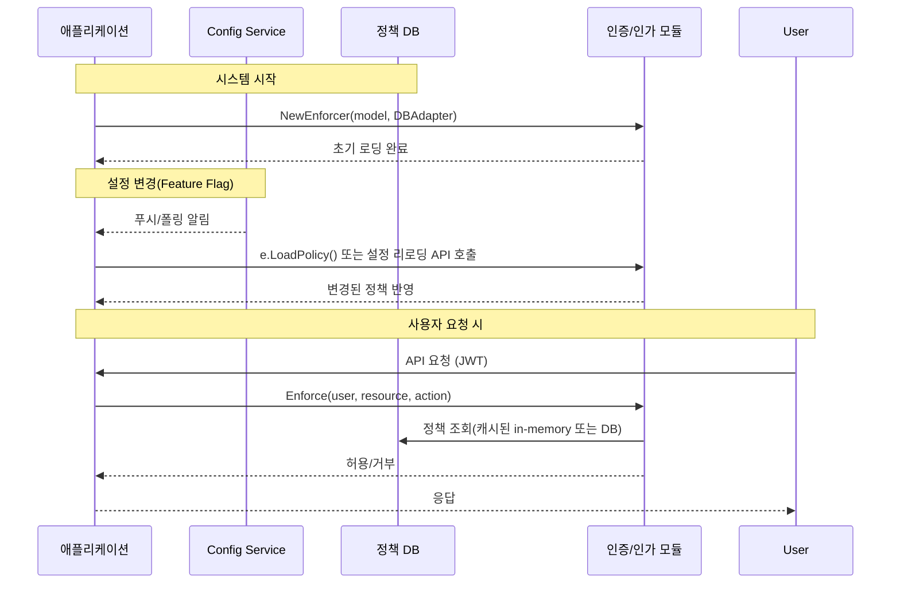

# 동적 반영을 위한 설계 요건

멀티테넌트 RBAC 시스템에서 **정적 코드(const로 하드코딩된 권한·모델)** 대신 **동적 구성(데이터베이스·설정 파일·Feature Flag)** 을 사용해야 하는 이유와 구현 방법을 정리하면 다음과 같습니다.

## 1. 동적 정책(Policy)·모델(Model) 로딩

- **Casbin** 예시
Casbin은 모델(`.conf`)과 정책(`.csv`, DB 등)을 런타임에 추가·삭제·수정할 수 있는 API를 제공한다.

```go
// 모델·정책 로드
e, _ := casbin.NewEnforcer("rbac_model.conf", adapter)
// 런타임에 정책 추가/삭제/수정
e.AddPolicy("alice", "data1", "read")
e.RemovePolicy("alice", "data1", "read")
e.UpdatePolicy([]string{"alice","data1","read"}, []string{"alice","data1","write"})
```

따라서 하드코딩 없이 DB로부터 즉시 반영 가능[^1][^2].
- **Spring Security**
Spring Security는 사용자의 인증(Authentication) 객체를 **SecurityContextHolder**에 재설정하여, 로그인 세션 유지 중에도 권한을 갱신할 수 있다.

```java
Authentication auth = SecurityContextHolder.getContext().getAuthentication();
List<GrantedAuthority> updated = new ArrayList<>(auth.getAuthorities());
updated.add(new SimpleGrantedAuthority("ROLE_NEW"));
Authentication newAuth = new UsernamePasswordAuthenticationToken(
    auth.getPrincipal(), auth.getCredentials(), updated);
SecurityContextHolder.getContext().setAuthentication(newAuth);
```

외부 DB로부터 권한을 조회해 매 요청마다 재설정하면 동적 반영이 가능하다[^3].


## 2. 동적 구성 관리 (Dynamic Configuration \& Feature Flags)

- **Feature Flag/Configuration 서비스**
Azure App Configuration, AWS AppConfig, Eppo, LaunchDarkly 등에서 제공하는 **Feature Flag**·**Dynamic Config**를 이용하면, 배포 없이 설정값(권한 맵핑, UI 요소, 알고리즘 모드 등)을 실시간 변경할 수 있다[^4][^5].
    - JSON·Key-Value 형태로 저장
    - TTL 설정으로 캐시 후 주기적 갱신
    - A/B 테스트와 조합 가능


## 3. 코드 관리 전략

1. **설정·메타데이터 분리**
    - 권한·모델·리소스 매핑 코드를 **소스 코드**가 아닌 **외부 설정**(DB·파일·Config Service)에 위임
    - 코드에는 이를 읽어들이는 **로더(Loader)**와 **캐시·무효화 전략**만 구현
2. **런타임 반영 방식**
    - **주기적 폴링(polling)** 또는 **이벤트 기반(watcher, webhook)** 으로 설정 변경 시점 감지
    - 변경 발생 시 즉시 **ReloadPolicy()**, **refresh Authentication** 호출
3. **상수 제거**
    - `const ROLE_ADMIN = "admin"` 같은 하드코딩 제거
    - 모든 권한 식별자는 **설정 테이블**에서 관리

## 4. 구현 예시 흐름



**결론:**
모델·정책·권한 매핑을 모두 외부 구성으로 분리하고, 런타임에 **ReloadPolicy()**, **SecurityContextHolder 재설정**, **Feature Flag 폴링/이벤트** 등을 통해 즉시 반영하도록 설계해야 합니다. 하드코딩된 `const`가 남아 있으면 동적 반영이 불가능하므로, 모든 핵심 설정은 **데이터베이스**나 **Config Service**로 이관해야만 완전한 동적 RBAC 시스템을 구현할 수 있습니다.

<div style="text-align: center">⁂</div>

[^1]: https://casbin.org/docs/api-overview

[^2]: https://v1.casbin.org/docs/en/adapters

[^3]: https://stackoverflow.com/questions/9910252/how-to-reload-authorities-on-user-update-with-spring-security

[^4]: https://docs.geteppo.com/feature-flagging/use-cases/dynamic-config/

[^5]: https://learn.microsoft.com/en-us/azure/azure-app-configuration/manage-feature-flags

[^6]: https://ran-isenberg.github.io/aws-lambda-handler-cookbook/best_practices/dynamic_configuration/

[^7]: https://github.com/casbin/casbin/issues/434

[^8]: https://www.youtube.com/watch?v=mq5oUXcAXL4

[^9]: https://casbin.org/docs/model-storage/

[^10]: https://github.com/faizakram/Spring-Dynamic-Role

[^11]: https://stackoverflow.com/questions/74754201/evaluate-casbin-policies-real-time

[^12]: https://github.com/SimonHarmonicMinor/spring-security-dynamic-roles-inheritance-model-example

[^13]: https://learn.microsoft.com/en-us/azure/azure-app-configuration/quickstart-feature-flag-aspnet-core

[^14]: https://taesan94.tistory.com/135

[^15]: https://justin.abrah.ms/2022-11-15-feature-flags-dynamic-config-and-experimentation.html

[^16]: https://github.com/casbin/casbin/issues/596

[^17]: https://velog.io/@dailylifecoding/spring-security-study-memo-authorization-feature-1

[^18]: https://octopus.com/devops/feature-flags/

[^19]: https://casbin.org/blog/

[^20]: https://jangjjolkit.tistory.com/28

