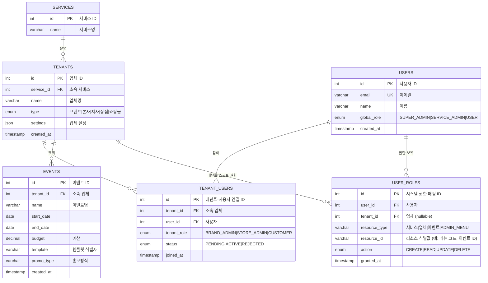

# 일반적인 멀티테넌시 RBAC 시스템 설계

아래 설계는 모든 **테넌트(업체)ㆍ유저ㆍ이벤트ㆍ어드민 메뉴** 권한을 동적으로 데이터베이스에서 관리하도록 고안되었습니다.

## 1. 핵심 개체 및 관계



- 서비스(Service)별로 여러 테넌트(업체)를 관리
- 사용자(Users)는 전역 역할(global_role)과 **테넌트별 역할(tenant_role)** 을 가짐
- 이벤트(Events)는 특정 테넌트에 귀속
- 모든 권한(User_Roles)은 **resource_type + resource_id + action** 으로 표현


## 2. 주요 시나리오별 흐름과 권한 매핑

| 시나리오 단계 | 수행 주체 | 주요 권한 검사 |
| :-- | :-- | :-- |
| 1 | SERVICE_ADMIN | User_Roles: (resource_type=“서비스”, action=CREATE) |
| 2 | BRAND_ADMIN 승인 전 | 사용자 생성(global_role=USER) |
| 3–4 | BRAND_ADMIN 승인 절차 | TENANT_USERS.status 변경 후 tenant_role 부여 |
| 5 | BRAND_ADMIN | User_Roles: (service, tenant=A브랜드, resource_type=“이벤트”, action=CREATE) |
| 6–8 | STORE_ADMIN 승인 절차 | TENANT_USERS.status 변경 후 tenant_role 부여 |
| 9 | STORE_ADMIN | User_Roles: (“이벤트”, C이벤트 ID, READ/UPDATE) |
| 10 | 일반유저 | User_Roles 자동 부여: (“TENANT”, B스토어, CUSTOMER) |
| 11 | STORE_ADMIN | User_Roles: (“이벤트”, C이벤트 ID, READ) |
| 12–13 | STORE_ADMIN → BRAND_ADMIN 정산 요청/승인 | User_Roles: (“이벤트”, C이벤트 ID, UPDATE) |

## 3. 동적 관리 모델 특성

1. **모든 권한**은 `USER_ROLES` 테이블에서 정의·변경
2. **테넌트 가입 승인**은 `TENANT_USERS.status`로 처리
3. **어드민 메뉴 접근**도 `USER_ROLES(resource_type=“ADMIN_MENU”, resource_id=메뉴코드, action=READ)`로 제어
4. **이벤트 예산·템플릿·홍보방식**은 `EVENTS`의 속성값으로 동적 확장 가능

## 4. 어드민 메뉴 예시

```sql
-- ADMIN_MENU 예시 시드
INSERT INTO USER_ROLES (user_id, resource_type, resource_id, action) VALUES
-- 서비스관리자
(1, 'ADMIN_MENU', 'SERVICE_MANAGE', 'READ'),
(1, 'ADMIN_MENU', 'SERVICE_MANAGE', 'UPDATE'),
-- 업체관리자(BRAND_ADMIN)
(2, 'ADMIN_MENU', 'TENANT_MANAGE', 'READ'),
(2, 'ADMIN_MENU', 'TENANT_MANAGE', 'UPDATE'),
-- 이벤트관리자
(3, 'ADMIN_MENU', 'EVENT_MANAGE', 'READ'),
(3, 'ADMIN_MENU', 'EVENT_MANAGE', 'CREATE'),
(3, 'ADMIN_MENU', 'EVENT_MANAGE', 'UPDATE');
```

이 구조를 기반으로 서비스·업체·이벤트·사용자·어드민 메뉴별 권한을 모두 데이터베이스에서 **동적으로** 관리할 수 있습니다.

