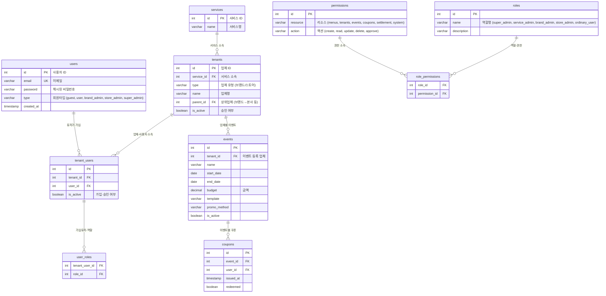

# 멀티테넌시 RBAC 시스템 설계

**주요 요구사항 요약**

- _서비스 관리_ (슈퍼관리자)와 _업체(브랜드 ← 본사·지사 · 스토어)_ 구분
- _이벤트_와 _유저_ (일반유저 · 업체관리자 · 슈퍼관리자) 역할
- 어드민 메뉴(메뉴관리·회원관리·업체관리·이벤트관리·시스템관리·서비스관리) 권한 분리
- 시나리오에 따른 가입·승인·이벤트 등록·쿠폰 발행·정산 요청 흐름
- 모든 권한·모델은 **DB 기반 동적 관리**


## 1. 핵심 엔티티 및 관계




## 2. 주요 흐름 시나리오 매핑

| 단계 | 시나리오 | 연관 테이블·작업 |
| :-- | :-- | :-- |
| 1 | 서비스관리자가 QR 홍보 시스템 생성 | `services` 신규 로우 |
| 2 | 일반회원(A 브랜드관리자 후보) 가입 | `users` + `tenant_users` |
| 3 | 브랜드 등록 요청(서류인증 대기) | `tenants` (type=‘브랜드’, is_active=false) |
| 4 | 승인 후 브랜드관리자 권한 부여 | `tenants`.is_active=true + `roles`(`brand_admin`) + `user_roles` |
| 5 | 브랜드관리자가 이벤트 등록 | `events` INSERT (tenant_id, 기간, 금액, template, promo_method) |
| 6 | B스토어관리자 가입(일반회원) | `users` + `tenant_users` (tenant=A브랜드) |
| 7 | B스토어 등록 요청(승인 대기) | `tenants` (type=‘스토어’, parent_id=A브랜드) |
| 8 | 승인 후 스토어관리자 권한 부여 | `tenants`.is_active=true + `roles`(`store_admin`) + `user_roles` |
| 9 | 스토어관리자가 이벤트 홍보 | `events` 조회·공유 |
| 10 | 일반유저 QR 가입·쿠폰 발행 | `users` + `coupons` INSERT |
| 11 | 스토어관리자 QR 코드 확인 | `coupons` 조회 (event_id, user_id) |
| 12 | 스토어 → 브랜드 대금 정산 요청 | `permissions` ‘settlement.create’ + 트랜잭션 워크플로우 |
| 13 | 브랜드 → 스토어 지급 | `permissions` ‘settlement.update’ |

## 3. 어드민 메뉴·기능 접근 권한 설정

| 메뉴 | resource | action |
| :-- | :-- | :-- |
| 메뉴관리 | menus | CRUD |
| 회원관리 | tenants/users | read/update |
| 업체관리 | tenants | approve |
| 이벤트관리 | events | CRUD |
| 시스템관리 | system | read/update |
| 서비스관리 | services | CRUD |

- `super_admin` : 전체 서비스·테넌트·사용자·이벤트 모두 제어
- `service_admin` : 특정 서비스 내 모든 자원 제어
- `brand_admin` : 소속 브랜드·자식 스토어·이벤트 제어
- `store_admin` : 소속 스토어·이벤트·쿠폰·정산 요청 제어
- `ordinary_user` : 본인 쿠폰 조회·발행


## 4. 동적 관리 설계 포인트

1. **정의 테이블**(roles, permissions, role_permissions)은 **외부에서 INSERT/UPDATE**로 손쉽게 추가·변경.
2. **할당 테이블**(user_roles, tenant_users)으로 역할·가입 상태 동적 변경.
3. **어드민 UI**에서 메뉴·권한 맵핑(permissions)과 역할(role→permissions) 편집 기능 제공.
4. **미들웨어**(`PermissionChecker`)가 요청 시마다 DB 조회 후 권한 검사.
```pseudo
function authorize(user, resource, action):
    perms = SELECT p.resource, p.action
            FROM user_roles ur
            JOIN role_permissions rp ON ur.role_id=rp.role_id
            JOIN permissions p ON rp.permission_id=p.id
            WHERE ur.tenant_user_id = current_context.tenant_user_id
    return (resource, action) in perms
```


## 5. Pennybase 검토

[pennybase](https://github.com/zserge/pennybase)는 **경량 GitHub Actions 워크플로우** 자동화 도구로, 멀티테넌시·RBAC 특화 기능은 제공하지 않습니다. DB 모델·마이그레이션, 권한 관리 기능은 별도 구현이 필요하며, 오히려 위 설계에 맞춘 프레임워크(예: Rails + acts_as_tenant + Pundit) 사용을 권장합니다.

<div style="text-align: center">⁂</div>

[^1]: https://github.com/zserge/pennybase

