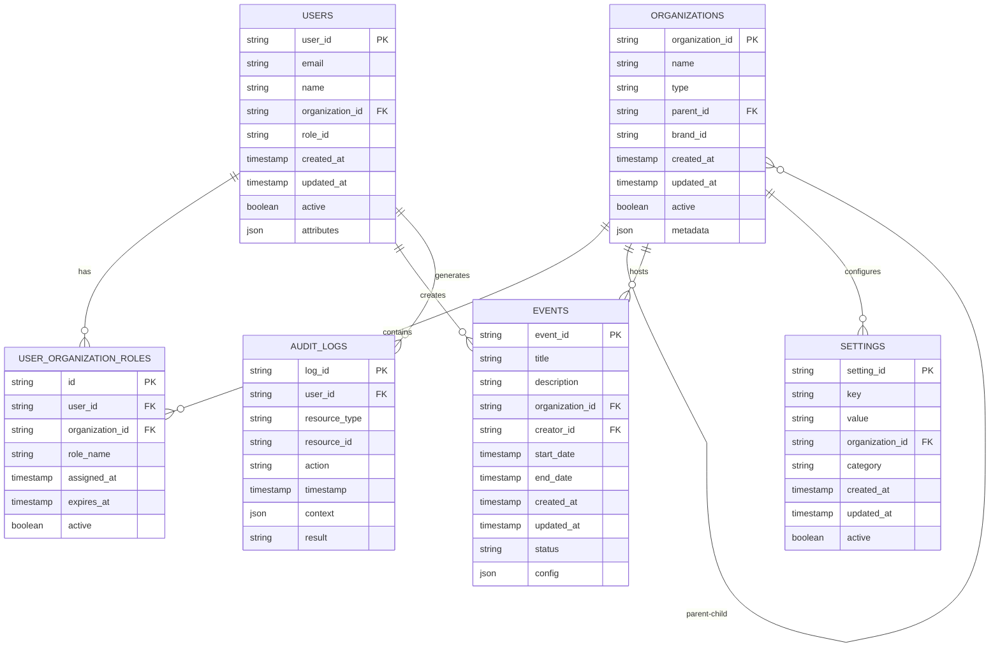
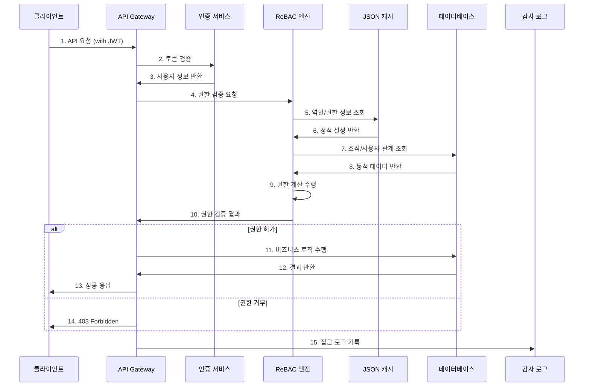
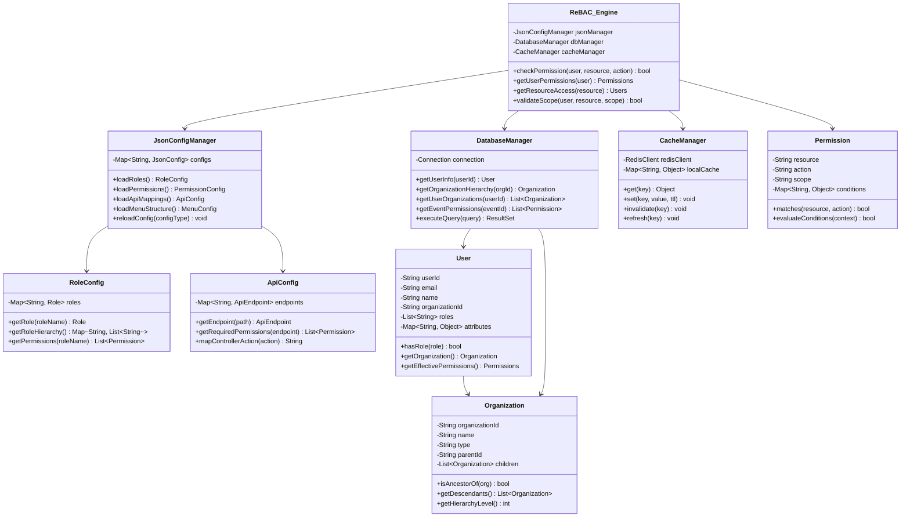
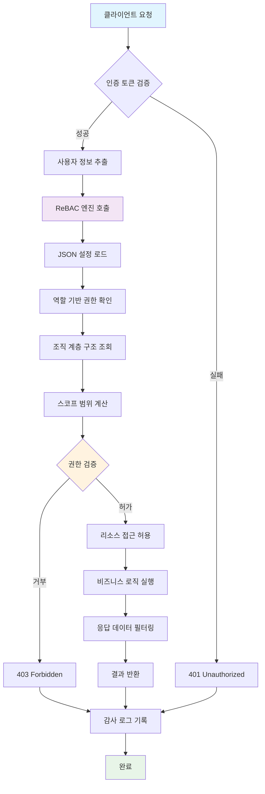

# JSON-DB 연계 ReBAC 시스템 설계 및 구현 가이드

## 기존 솔루션 분석

JSON 설정과 데이터베이스를 결합한 ReBAC 시스템은 새로운 접근 방식으로, 기존 솔루션들과 차별화된 하이브리드 아키텍처를 제공합니다[1][2][3].

### 주요 기존 솔루션들

**Google Zanzibar 기반 솔루션**

- **OpenFGA**: 오픈소스 Zanzibar 구현체로 순수 관계 기반 접근법 사용[4][5]
- **SpiceDB**: AuthZed에서 개발한 고성능 ReBAC 데이터베이스[6][7]
- **Permify**: Google Zanzibar 영감을 받은 권한 서비스[8][9]

**정책 기반 솔루션**

- **Oso**: 다양한 접근 제어 모델 지원하는 권한 서비스[10][11]
- **OPA (Open Policy Agent)**: 정책 기반 접근 제어를 위한 범용 엔진[12][13]

**하이브리드 접근법**

- **AWS Neptune + ReBAC**: 그래프 데이터베이스를 활용한 관계 기반 권한 관리[14]
- **Neo4j + Enterprise OPA**: 그래프 데이터베이스와 정책 엔진 결합[15]


## 시스템 설계

### 아키텍처 다이어그램



*ERD 다이어그램: 동적 엔티티들 간의 관계를 나타내며, 조직 계층구조와 사용자 역할 매핑을 중심으로 설계*

### 시퀀스 다이어그램



*시퀀스 다이어그램: JSON 캐시와 데이터베이스를 동시에 활용하는 하이브리드 권한 검증 플로우*

### 클래스 다이어그램



*클래스 다이어그램: 시스템의 핵심 컴포넌트들과 이들 간의 관계를 나타내며, JSON 설정과 데이터베이스 관리를 분리하여 설계*

### 액션 플로우 다이어그램



*액션 플로우 다이어그램: 권한 검증 과정의 전체 흐름을 나타내며, 각 단계별 처리 로직을 시각화*

## 핵심 설계 원칙

### 하이브리드 스토리지 전략

**JSON 파일 관리 (정적 설정)**

- 역할 정의 및 권한 레벨 (roles.json)
- 리소스별 권한 매핑 (permissions.json)
- API 엔드포인트 설정 (api.json)
- 메뉴 구조 및 접근 권한 (menu.json)
- 기능별 권한 정의 (function.json)

**데이터베이스 관리 (동적 엔티티)**

- 사용자 정보 및 속성 (users 테이블)
- 조직 계층 구조 (organizations 테이블)
- 이벤트 및 프로모션 (events 테이블)
- 동적 설정 값 (settings 테이블)


### 성능 최적화 전략

**캐시 정책**[16]

- JSON 설정: 1시간 TTL로 메모리 캐싱
- 사용자 권한: 30분 TTL로 Redis 캐싱
- 조직 계층: 1시간 TTL로 분산 캐싱

**쿼리 최적화**[17]

- 계층 구조 CTE(Common Table Expression) 활용
- 복합 인덱스를 통한 조회 성능 향상
- 연결 테이블 최적화로 조인 성능 개선


## 구현 가이드

### 1단계: 기본 구조 구축

**디렉터리 구조**

```
📁 config/
├── roles.json          # 역할 정의
├── permissions.json     # 권한 매핑
├── api.json            # API 엔드포인트 설정
├── menu.json           # 메뉴 구조
└── function.json       # 기능별 권한

📁 src/
├── rebac/
│   ├── engine.py       # ReBAC 엔진 핵심
│   ├── config.py       # JSON 설정 관리
│   ├── database.py     # DB 연동
│   └── cache.py        # 캐시 관리
└── api/
    ├── middleware.py   # 권한 검증 미들웨어
    └── decorators.py   # 권한 데코레이터
```


### 2단계: 데이터베이스 설계

**핵심 테이블 구조**

```sql
-- 사용자 조회 최적화를 위한 복합 인덱스
CREATE INDEX idx_users_organization_role 
ON users(organization_id, role_id);

-- 조직 계층 구조 효율적 탐색을 위한 인덱스
CREATE INDEX idx_organizations_parent 
ON organizations(parent_id);

-- 감사 로그 성능 최적화를 위한 시간순 인덱스
CREATE INDEX idx_audit_logs_user_timestamp 
ON audit_logs(user_id, timestamp);
```


### 3단계: ReBAC 엔진 구현

**권한 검증 핵심 로직**

```python
def get_organization_hierarchy(org_id):
    """조직 계층 구조를 효율적으로 조회하는 재귀 쿼리"""
    with recursive_query as (
        select organization_id, parent_id, 0 as level
        from organizations where organization_id = %s
        union all
        select o.organization_id, o.parent_id, rq.level + 1
        from organizations o
        join recursive_query rq on o.parent_id = rq.organization_id
    )
    select * from recursive_query
```


## 차별화된 장점

### 기존 솔루션 대비 우위점

**OpenFGA/SpiceDB 대비**[4][6]

- JSON 설정을 통한 비개발자 친화적 권한 관리
- 기존 데이터베이스 스키마와의 원활한 통합
- 설정 변경 시 코드 수정 없이 hot-reload 가능

**OPA 대비**[12][13]

- 복잡한 Rego 언어 학습 없이 JSON으로 간단한 설정
- 관계 기반 권한과 정책 기반 권한의 하이브리드 지원
- 데이터베이스 직접 연동으로 성능 향상

**순수 데이터베이스 솔루션 대비**[18][17]

- EAV 패턴의 복잡성 없이 구조화된 권한 관리
- JSON 설정을 통한 유연한 권한 정의
- 캐시 레이어를 통한 고성능 실현


### 보안 및 운영 고려사항

**보안 강화**[19][20]

- 모든 권한 검증 결과의 완전한 감사 추적
- JWT 기반 인증과 ReBAC 권한 검증의 분리
- 입력 검증 및 SQL 인젝션 방지

**운영 편의성**[21][22]

- 무중단 배포를 위한 Blue-Green 전략
- JSON 설정의 버전 관리 및 롤백 기능
- 실시간 모니터링 및 알림 시스템


## 결론

이 하이브리드 JSON-DB ReBAC 시스템은 기존 솔루션들의 한계를 극복하고, 실제 비즈니스 요구사항에 맞춘 실용적인 접근법을 제공합니다. JSON 설정의 유연성과 데이터베이스의 성능을 결합하여, 확장 가능하고 유지보수가 용이한 권한 관리 시스템을 구현할 수 있습니다[1][23][24].

특히 제시된 예시와 같은 쿠폰/정산 시스템에서는 브랜드-매장 계층구조와 역할 기반 권한이 명확하게 구분되어 있어, 이 하이브리드 접근법이 매우 적합한 솔루션이 될 것입니다[25][26][27].

